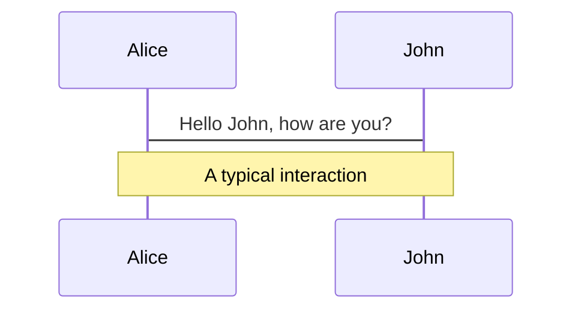
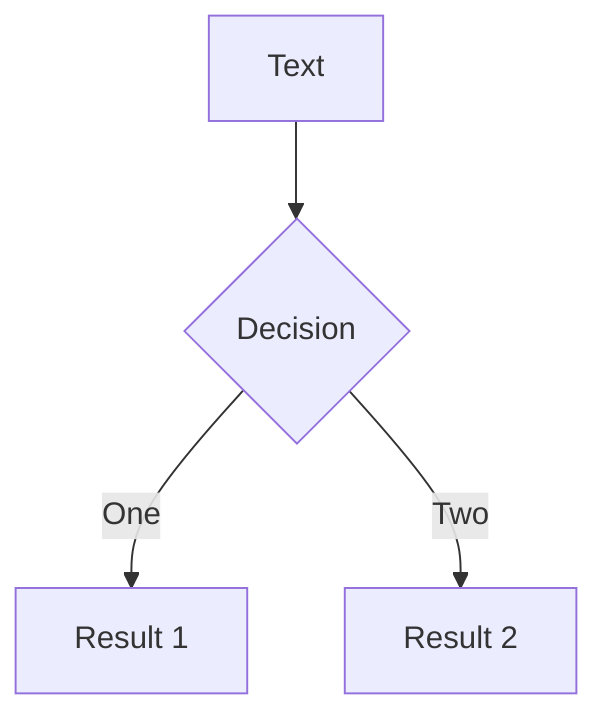
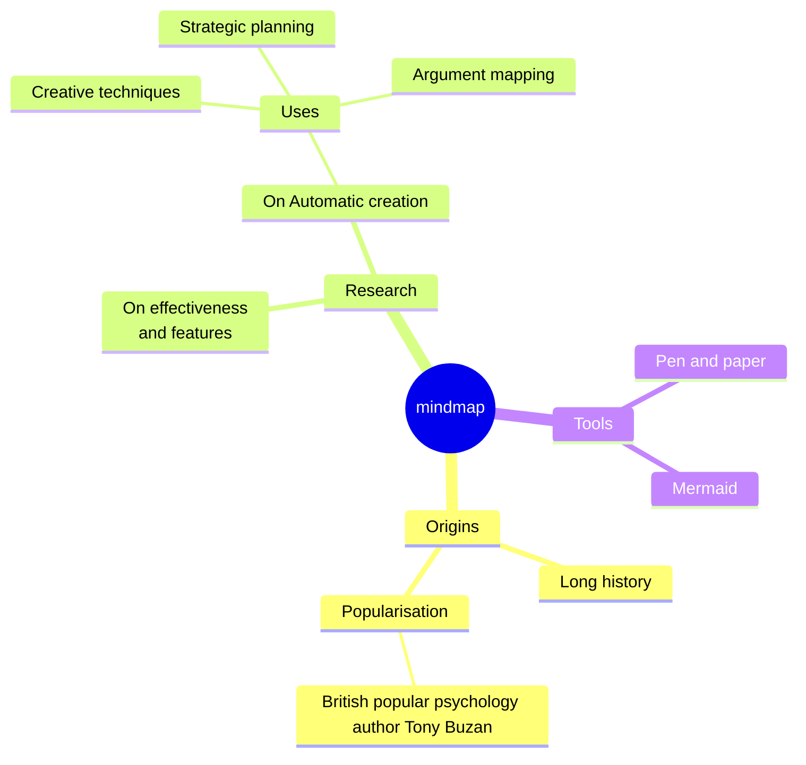
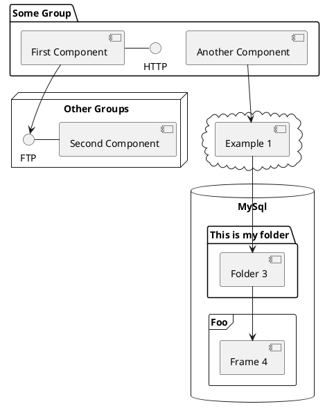

---
# You can also start simply with 'default'
theme: apple-basic
# random image from a curated Unsplash collection by Anthony
# like them? see https://unsplash.com/collections/94734566/slidev
background: https://cover.sli.dev
# some information about your slides (markdown enabled)
title: Welcome to Slidev
info: |
  ## Slidev Starter Template
  Presentation slides for developers.

  Learn more at [Sli.dev](https://sli.dev)
# apply unocss classes to the current slide
class: text-center
# https://sli.dev/features/drawing
drawings:
  persist: false
# slide transition: https://sli.dev/guide/animations.html#slide-transitions
transition: slide-left
# enable MDC Syntax: https://sli.dev/features/mdc
mdc: true
---

# Welcome to Slidev

Presentation slides for developers

<div @click="$slidev.nav.next" class="py-1 mt-12" hover:bg="white op-10">
  Press Space for next page <carbon:arrow-right />
</div>

<div class="m-6 text-xl abs-br">
  <button @click="$slidev.nav.openInEditor" title="Open in Editor" class="slidev-icon-btn">
    <carbon:edit />
  </button>
  <a href="https://github.com/slidevjs/slidev" target="_blank" class="slidev-icon-btn">
    <carbon:logo-github />
  </a>
</div>

<!--
The last comment block of each slide will be treated as slide notes. It will be visible and editable in Presenter Mode along with the slide. [Read more in the docs](https://sli.dev/guide/syntax.html#notes)
-->

---
transition: fade-out
class: p-0
layout: full
---

<div class="flex flex-col justify-between p-14 h-full"> 
  <div class="space-y-2">
    <p class="text-xl font-black">Background</p>
    <p class="text-sm">
      This platform is designed to provide a comprehensive overview of Taiwan's medical and health training courses and achievements for foreign medical professionals. It also offers more complete training information and application services through the platform.
    </p>
  </div>
  <div class="grid grid-cols-4 gap-6">
    <div class="space-y-2">
      <p class="text-xl font-black">Role</p>
      <ul class="text-xs">
        <li>UI/UX Designer</li>
        <li>Product Roadmap</li>
      </ul>
    </div>
    <div class="space-y-2">
      <p class="text-xl font-black">Team</p>
      <ul class="text-xs">
        <li>1 Product Designer</li>
        <li>1 Product Manager</li>
        <li>1 Systems Analysis</li>
        <li>1 Front-end Developer</li>
        <li>3 Back-end Developer</li>
      </ul>
    </div>
    <div class="space-y-2">
      <p class="text-xl font-black">Timeline</p>
      <p class="text-xs">
        More than 1 year
        <br>
        <span class="text-gray-400">
          (2023.10 - Now)
        </span>
      </p>
    </div>
    <div class="space-y-2">
      <p class="text-xl font-black">Company</p>
      <p class="text-xs">
        Joint Commission of Taiwan
      </p>
    </div>
  </div>
</div>

---
transition: fade-out
class: p-0
layout: full
---

<div class="flex flex-col justify-between p-14 h-full"> 
  <div class="space-y-2">
    <p class="text-xl font-black">Design Flow</p>
    <p class="text-sm">
      In this project, I focused on designing the overall website architecture to ensure users could browse courses and complete the registration process. My primary responsibility was to plan an online course registration system that is user-friendly and allows users to verify their application results. 
      <br>
      <br>
      The goal of the platform is to foster closer medical exchange and collaboration with other countries, promoting the bidirectional sharing of knowledge and skills.
    </p>
  </div>
  <div class="grid grid-cols-4 gap-6">
    <div class="space-y-2">
      <p class="text-xl font-black">Research</p>
      <ul class="text-xs">
        <li>Website IA</li>
        <li>Course Information Display Requirements</li>
        <li>Course Registration and Review System</li>
      </ul>
    </div>
    <div class="space-y-2">
      <p class="text-xl font-black">Define</p>
      <ul class="text-xs">
        <li>Website Design Specifications</li>
        <li>Online Course Registration Workflow</li>
        <li>Online Course Registration Review Process</li>
        <li>Web/App Editor Compatibility</li>
      </ul>
    </div>
    <div class="space-y-2">
      <p class="text-xl font-black">Design</p>
      <ul class="text-xs">
        <li>Component Design</li>
        <li>Website UI Design</li>
        <li>Responsive Website Compatibility</li>
      </ul>
    </div>
    <div class="space-y-2">
      <p class="text-xl font-black">Company</p>
      <ul class="text-xs">
        <li>Testing & Collect Feedback</li>
      </ul>
    </div>
  </div>
</div>

---
transition: slide-left
class: p-0
layout: full
---

<div class="flex flex-col justify-between p-14 h-full"> 
  <div class="flex items-center">
    <svg xmlns="http://www.w3.org/2000/svg" 
     viewBox="0 0 512 512" 
     width="24" 
     height="24"
     >
      <path d="M464 256A208 208 0 1 0 48 256a208 208 0 1 0 416 0zM0 256a256 256 0 1 1 512 0A256 256 0 1 1 0 256zM174.6 384.1c-4.5 12.5-18.2 18.9-30.7 14.4s-18.9-18.2-14.4-30.7C146.9 319.4 198.9 288 256 288s109.1 31.4 126.6 79.9c4.5 12.5-2 26.2-14.4 30.7s-26.2-2-30.7-14.4C328.2 358.5 297.2 336 256 336s-72.2 22.5-81.4 48.1zM144.4 208a32 32 0 1 1 64 0 32 32 0 1 1 -64 0zm192-32a32 32 0 1 1 0 64 32 32 0 1 1 0-64z"/>
    </svg>
    <p class="pl-2 text-xl font-black">
      User Pain Point
    </p>
  </div>
  <div class="grid grid-cols-3 gap-y-4 gap-x-8">
    <div class="">
      <p class="text-lg font-black">Low-profile hospital promotion</p>
      <p class="text-xs">
        The hospital's authoritative departments are fully equipped but take a more low-profile approach in promotion.
      </p>
    </div>
    <div class="">
      <p class="text-lg font-black">Insufficient training information</p>
      <p class="text-xs">
        Training information is insufficient, making it difficult to clearly understand the overall application process.
      </p>
    </div>
    <div class="">
      <p class="text-lg font-black">Customized training programs</p>
      <p class="text-xs">
        Overseas healthcare personnel have clear learning goals and require customized training programs.
      </p>
    </div>
    <div class="">
      <p class="text-lg font-black">Issues with document resubmission</p>
      <p class="text-xs">
        The process of submitting supplementary documents is time-consuming, labor-intensive, and disorganized.
      </p>
    </div>
    <div class="">
      <p class="text-lg font-black">Training results and evaluations</p>
      <p class="text-xs">
        Overseas personnel find it difficult to access training results and evaluations, making it challenging to showcase training achievements externally.
      </p>
    </div>
  </div>
</div>

---
transition: fade-out
class: p-0
layout: full
---

<div class="grid grid-cols-2 items-center p-14 h-full"> 
  <p class="text-7xl font-black">Our Goal</p>
  <ol class="text-sm list-decimal">
    <li>Establish a registration system that includes authentication</li>
    <li>Integrate course resources from national medical institutions</li>
    <li>Provide multi-language switch for the website</li>
    <li>Provide course classification and filtering functions</li>
    <li>Provide individual and group registration functions for courses</li>
    <li>Allow participants to view the registration review results</li>
    <li>Students can consult with the course provider online</li>
  </ol>
</div>

---
transition: slide-left
class: p-0
layout: full
---

<div class="grid grid-cols-2 items-center p-14 h-full"> 
  <p class="text-7xl font-black">Solution</p>
  <ol class="text-sm list-decimal">
    <li>Display course training evaluation results</li>
    <li>Provide course information and filtering functions</li>
    <li>Design a document upload and automatic verification system</li>
    <li>Establish a multilingual frameworks</li>
    <li>Create a dual registration mode with dynamic forms</li>
    <li>Develop a registration status tracking feature</li>
  </ol>
</div>

---
transition: slide-left
class: p-0
layout: full
---

<div class="grid grid-cols-2 items-center h-full"> 
  <div class="p-14 space-y-2">
    <p class="text-2xl font-black">Some impacts on the project</p>
    <ol class="text-sm list-decimal">
      <li>The client was unable to provide clear requirements</li>
      <li>The project architecture was extensive</li>
      <li>The development timeline was tight</li>
    </ol>
  </div>
  
</div>

---
transition: fade-out
class: p-0
layout: full
---

<div class="grid grid-cols-2 items-center p-14 h-full"> 
  <p class="text-7xl font-black leading-loose">Research<br><br><br>&<br><br><br>Define</p>
  <div>
    <p>
      After analyzing user needs and the functional architecture, I set 2 design directions for the project:
    </p>
    <ol class="text-sm list-decimal">
      <li>
        Target Audience-Oriented
        <br>
        <span>
          <ul class="text-gray-500">
            <li>Courses categorized by professional fields.</li>
            <li>The color selection is composed of stable and medical tones.</li>
          </ul>
        </span>
      </li>
      <li>
        Enhancing User Experience
        <br>
        <span>
          <ul class="text-gray-500">
            <li>Provide custom search and filter options.</li>
            <li>A registration process that is easy to complete.</li>
            <li>Convenient visibility of the review status.</li>
          </ul>
        </span>
      </li>
    </ol>
  </div>
</div>

---
transition: fade-out
class: p-0
layout: full
---

<div class="p-14 h-full text-center"> 
  <p class="text-2xl font-black">Training Course Categories</p>
  
</div>

---
transition: slide-left
---

# Hello?

Slidev is a slides maker and presenter designed for developers, consist of the following features.

- 📝 **Text-based** - focus on the content with Markdown, and then style them later
- 🎨 **Themable** - themes can be shared and re-used as npm packages
- 🧑‍💻 **Developer Friendly** - code highlighting, live coding with autocompletion
- 🤹 **Interactive** - embed Vue components to enhance your expressions
- 🎥 **Recording** - built-in recording and camera view
- 📤 **Portable** - export to PDF, PPTX, PNGs, or even a hostable SPA
- 🛠 **Hackable** - virtually anything that's possible on a webpage is possible in Slidev
<br>
<br>

Read more about [Why Slidev?](https://sli.dev/guide/why)

<!--
You can have `style` tag in markdown to override the style for the current page.
Learn more: https://sli.dev/features/slide-scope-style
-->

<style>
h1 {
  background-color: #2B90B6;
  background-image: linear-gradient(45deg, #4EC5D4 10%, #146b8c 20%);
  background-size: 100%;
  -webkit-background-clip: text;
  -moz-background-clip: text;
  -webkit-text-fill-color: transparent;
  -moz-text-fill-color: transparent;
}
</style>

<!--
Here is another comment.
-->

---
transition: slide-up
level: 2
---

# Navigation

Hover on the bottom-left corner to see the navigation's controls panel, [learn more](https://sli.dev/guide/ui#navigation-bar)

## Keyboard Shortcuts

|                                                     |                             |
| --------------------------------------------------- | --------------------------- |
| <kbd>right</kbd> / <kbd>space</kbd>                 | next animation or slide     |
| <kbd>left</kbd>  / <kbd>shift</kbd><kbd>space</kbd> | previous animation or slide |
| <kbd>up</kbd>                                       | previous slide              |
| <kbd>down</kbd>                                     | next slide                  |

<!-- https://sli.dev/guide/animations.html#click-animation -->

<p v-after class="absolute opacity-30 transform bottom-23 left-45 -rotate-10">Here!</p>

---
layout: two-cols
layoutClass: gap-16
---

# Table of contents

You can use the `Toc` component to generate a table of contents for your slides:

```html
<Toc minDepth="1" maxDepth="1" />
```

The title will be inferred from your slide content, or you can override it with `title` and `level` in your frontmatter.

::right::

<Toc text-sm minDepth="1" maxDepth="2" />

---
layout: image-right
image: https://cover.sli.dev
---

# Code

Use code snippets and get the highlighting directly, and even types hover!

```ts {all|5|7|7-8|10|all} twoslash
// TwoSlash enables TypeScript hover information
// and errors in markdown code blocks
// More at https://shiki.style/packages/twoslash

import { computed, ref } from 'vue'

const count = ref(0)
const doubled = computed(() => count.value * 2)

doubled.value = 2
```

<arrow v-click="[4, 5]" x1="350" y1="310" x2="195" y2="334" color="#953" width="2" arrowSize="1" />

<!-- This allow you to embed external code blocks -->
<<< @/snippets/external.ts#snippet

<!-- Footer -->

[Learn more](https://sli.dev/features/line-highlighting)

<!-- Inline style -->
<style>
.footnotes-sep {
  @apply mt-5 opacity-10;
}
.footnotes {
  @apply text-sm opacity-75;
}
.footnote-backref {
  display: none;
}
</style>

<!--
Notes can also sync with clicks

[click] This will be highlighted after the first click

[click] Highlighted with `count = ref(0)`

[click:3] Last click (skip two clicks)
-->

---
level: 2
---

# Shiki Magic Move

Powered by [shiki-magic-move](https://shiki-magic-move.netlify.app/), Slidev supports animations across multiple code snippets.

Add multiple code blocks and wrap them with <code>````md magic-move</code> (four backticks) to enable the magic move. For example:

````md magic-move {lines: true}
```ts {*|2|*}
// step 1
const author = reactive({
  name: 'John Doe',
  books: [
    'Vue 2 - Advanced Guide',
    'Vue 3 - Basic Guide',
    'Vue 4 - The Mystery'
  ]
})
```

```ts {*|1-2|3-4|3-4,8}
// step 2
export default {
  data() {
    return {
      author: {
        name: 'John Doe',
        books: [
          'Vue 2 - Advanced Guide',
          'Vue 3 - Basic Guide',
          'Vue 4 - The Mystery'
        ]
      }
    }
  }
}
```

```ts
// step 3
export default {
  data: () => ({
    author: {
      name: 'John Doe',
      books: [
        'Vue 2 - Advanced Guide',
        'Vue 3 - Basic Guide',
        'Vue 4 - The Mystery'
      ]
    }
  })
}
```

Non-code blocks are ignored.

```vue
<!-- step 4 -->
<script setup>
const author = {
  name: 'John Doe',
  books: [
    'Vue 2 - Advanced Guide',
    'Vue 3 - Basic Guide',
    'Vue 4 - The Mystery'
  ]
}
</script>
```
````

---

# Components

<div grid="~ cols-2 gap-4">
<div>

You can use Vue components directly inside your slides.

We have provided a few built-in components like `<Tweet/>` and `<Youtube/>` that you can use directly. And adding your custom components is also super easy.

```html
<Counter :count="10" />
```

<!-- ./components/Counter.vue -->
<Counter :count="10" m="t-4" />

Check out [the guides](https://sli.dev/builtin/components.html) for more.

</div>
<div>

```html
<Tweet id="1390115482657726468" />
```

<Tweet id="1390115482657726468" scale="0.65" />

</div>
</div>

<!--
Presenter note with **bold**, *italic*, and ~~striked~~ text.

Also, HTML elements are valid:
<div class="flex w-full">
  <span style="flex-grow: 1;">Left content</span>
  <span>Right content</span>
</div>
-->

---
class: px-20
---

# Themes

Slidev comes with powerful theming support. Themes can provide styles, layouts, components, or even configurations for tools. Switching between themes by just **one edit** in your frontmatter:

<div grid="~ cols-2 gap-2" m="t-2">

```yaml
---
theme: default
---
```

```yaml
---
theme: seriph
---
```


</div>

Read more about [How to use a theme](https://sli.dev/guide/theme-addon#use-theme) and
check out the [Awesome Themes Gallery](https://sli.dev/resources/theme-gallery).

---

# Clicks Animations

You can add `v-click` to elements to add a click animation.

<div v-click>

This shows up when you click the slide:

```html
<div v-click>This shows up when you click the slide.</div>
```

</div>

<br>

<v-click>

The <span v-mark.red="3"><code>v-mark</code> directive</span>
also allows you to add
<span v-mark.circle.orange="4">inline marks</span>
, powered by [Rough Notation](https://roughnotation.com/):

```html
<span v-mark.underline.orange>inline markers</span>
```

</v-click>

<div mt-20 v-click>

[Learn more](https://sli.dev/guide/animations#click-animation)

</div>

---

# Motions

Motion animations are powered by [@vueuse/motion](https://motion.vueuse.org/), triggered by `v-motion` directive.

```html
<div
  v-motion
  :initial="{ x: -80 }"
  :enter="{ x: 0 }"
  :click-3="{ x: 80 }"
  :leave="{ x: 1000 }"
>
  Slidev
</div>
```

<div class="relative w-60">
  <div class="relative w-40 h-40">
    
    
    
  </div>

  <div
    class="text-5xl absolute top-14 left-40 text-[#2B90B6] -z-1"
    v-motion
    :initial="{ x: -80, opacity: 0}"
    :enter="{ x: 0, opacity: 1, transition: { delay: 2000, duration: 1000 } }">
    Slidev
  </div>
</div>

<!-- vue script setup scripts can be directly used in markdown, and will only affects current page -->
<script setup lang="ts">
const final = {
  x: 0,
  y: 0,
  rotate: 0,
  scale: 1,
  transition: {
    type: 'spring',
    damping: 10,
    stiffness: 20,
    mass: 2
  }
}
</script>

<div
  v-motion
  :initial="{ x:35, y: 30, opacity: 0}"
  :enter="{ y: 0, opacity: 1, transition: { delay: 3500 } }">

[Learn more](https://sli.dev/guide/animations.html#motion)

</div>

---

# LaTeX

LaTeX is supported out-of-box. Powered by [KaTeX](https://katex.org/).

<div h-3 />

Inline $\sqrt{3x-1}+(1+x)^2$

Block
$$ {1|3|all}
\begin{aligned}
\nabla \cdot \vec{E} &= \frac{\rho}{\varepsilon_0} \\
\nabla \cdot \vec{B} &= 0 \\
\nabla \times \vec{E} &= -\frac{\partial\vec{B}}{\partial t} \\
\nabla \times \vec{B} &= \mu_0\vec{J} + \mu_0\varepsilon_0\frac{\partial\vec{E}}{\partial t}
\end{aligned}
$$

[Learn more](https://sli.dev/features/latex)

---

# Diagrams

You can create diagrams / graphs from textual descriptions, directly in your Markdown.

<div class="grid grid-cols-4 gap-5 pt-4 -mb-6">









</div>

Learn more: [Mermaid Diagrams](https://sli.dev/features/mermaid) and [PlantUML Diagrams](https://sli.dev/features/plantuml)

---
foo: bar
dragPos:
  square: 691,32,167,_,-16
---

# Draggable Elements

Double-click on the draggable elements to edit their positions.

<br>

###### Directive Usage

```md

```

<br>

###### Component Usage

```md
<v-drag text-3xl>
  <div class="i-carbon:arrow-up" />
  Use the `v-drag` component to have a draggable container!
</v-drag>
```

<v-drag pos="663,206,261,_,-15">
  <div text-center text-3xl border border-main rounded>
    Double-click me!
  </div>
</v-drag>


###### Draggable Arrow

```md
<v-drag-arrow two-way />
```

<v-drag-arrow pos="67,452,253,46" two-way op70 />

---
src: ./pages/imported-slides.md
hide: false
---

---

# Monaco Editor

Slidev provides built-in Monaco Editor support.

Add `{monaco}` to the code block to turn it into an editor:

```ts {monaco}
import { ref } from 'vue'
import { emptyArray } from './external'

const arr = ref(emptyArray(10))
```

Use `{monaco-run}` to create an editor that can execute the code directly in the slide:

```ts {monaco-run}
import { version } from 'vue'
import { emptyArray, sayHello } from './external'

sayHello()
console.log(`vue ${version}`)
console.log(emptyArray<number>(10).reduce(fib => [...fib, fib.at(-1)! + fib.at(-2)!], [1, 1]))
```

---
layout: center
class: text-center
---

# Learn More

[Documentation](https://sli.dev) · [GitHub](https://github.com/slidevjs/slidev) · [Showcases](https://sli.dev/resources/showcases)

<PoweredBySlidev mt-10 />
