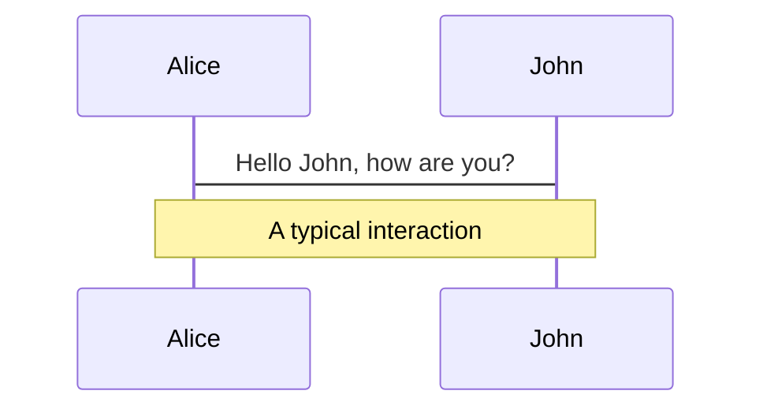
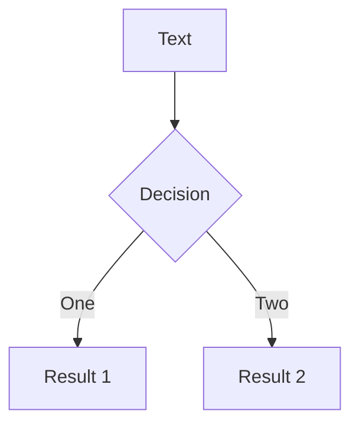
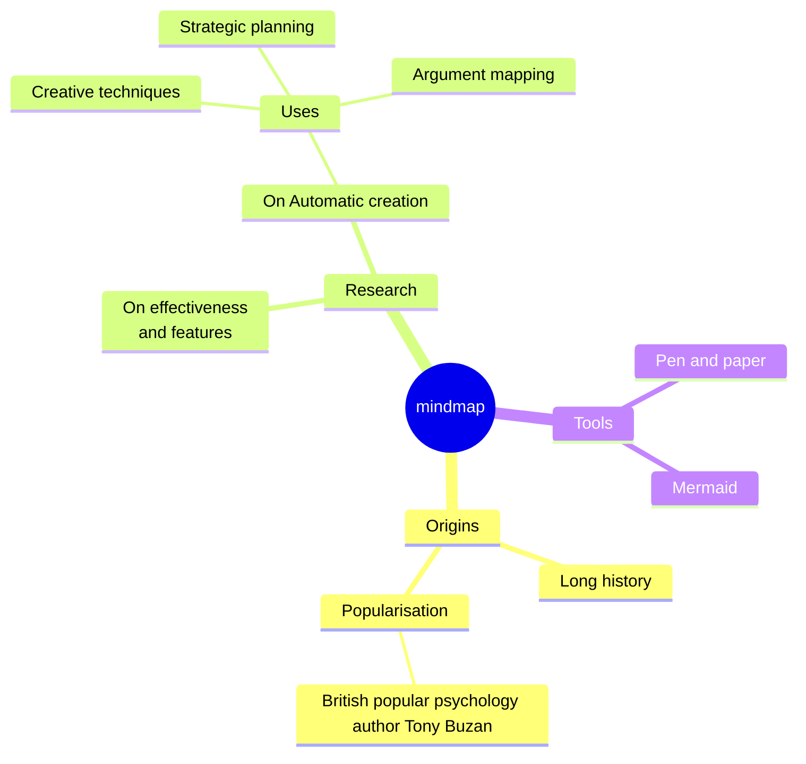
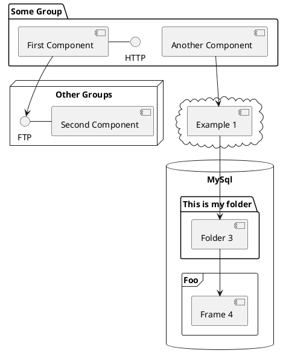

---
# You can also start simply with 'default'
theme: apple-basic
# random image from a curated Unsplash collection by Anthony
# like them? see https://unsplash.com/collections/94734566/slidev
background: https://cover.sli.dev
# some information about your slides (markdown enabled)
title: Case Study
info: |
  ## Healthcare Academy
  Speaker: Tina Chen

# apply unocss classes to the current slide
class: text-center
# https://sli.dev/features/drawing
drawings:
  persist: false
# slide transition: https://sli.dev/guide/animations.html#slide-transitions
transition: slide-up
# enable MDC Syntax: https://sli.dev/features/mdc
mdc: true
---

# Welcome to Slidev

Presentation slides for developers

<div @click="$slidev.nav.next" class="py-1 mt-12" hover:bg="white op-10">
  Press Space for next page <carbon:arrow-right />
</div>

<div class="m-6 text-xl abs-br">
  <button @click="$slidev.nav.openInEditor" title="Open in Editor" class="slidev-icon-btn">
    <carbon:edit />
  </button>
  <a href="https://github.com/slidevjs/slidev" target="_blank" class="slidev-icon-btn">
    <carbon:logo-github />
  </a>
</div>

<!--
The last comment block of each slide will be treated as slide notes. It will be visible and editable in Presenter Mode along with the slide. [Read more in the docs](https://sli.dev/guide/syntax.html#notes)
-->

---
transition: slide-up
class: p-0
layout: full
---

<div class="flex flex-row gap-24 justify-center items-center px-32 py-14 h-full">
  <div class="relative w-1/2">
    <div class="absolute -left-4 -top-8 z-10 w-52">
      <ChatBubble />
    </div>
    
  </div>
  <div class="w-full">
    <p class="font-black">
      I am a UI/UX designer with 3 years of experience and a background in Business Administration.
    </p>
    <ul class="text-xs">
      <li>Passion-Driven</li>
      <li>Curious-Minded</li>
      <li>Quick Learner</li>
    </ul>
  </div>
</div>

<script setup lang="ts">
const final = {
  x: 0,
  y: 0,
  rotate: 0,
  scale: 1,
  transition: {
    type: 'spring',
    damping: 10,
    stiffness: 20,
    mass: 2
  }
}
</script>

<!--
大家好，我是 Tina，擁有三年的 UI/UX 設計經驗，同時具備企業管理碩士背景。

我是一位對設計充滿熱情且富有好奇心的設計師，樂於持續學習並快速吸收新知。

我相信這樣的特質，讓我在設計的每個階段都能保持敏銳的觀察與創新的思維。
-->

---
transition: slide-up
class: p-0
layout: full
---

<div class="relative w-40 h-40">
  
  
  
</div>

<script setup lang="ts">
const final = {
  x: 0,
  y: 0,
  rotate: 0,
  scale: 1,
  transition: {
    type: 'spring',
    damping: 10,
    stiffness: 20,
    mass: 2
  }
}
</script>

---
transition: slide-up
class: p-0
layout: full
---

<div class="flex flex-col gap-20 py-14 h-full text-center">
  <p class="text-4xl font-black">Work Experiences</p>
  <div class="flex items-center px-6 py-4 w-full bg-blue-50/70 dark:bg-blue-900">
    <Timeline />
  </div>
</div>

<!--
接下來，我想與大家分享我的工作經歷。

我曾在 CIER 擔任研究員，這段經歷讓我培養了資料分析與市場洞察的能力。同年，我也在 TCA 擔任專案經理，負責協調跨部門溝通與專案進度管理，進一步提升了我的專案管理技巧。

後續職涯中，我轉職成為 UI/UX 設計師，在 JING WEI Co. 參與了多項設計專案，並逐漸建立了扎實的設計流程與使用者研究能力。

目前，我於 UARK 繼續以 UI/UX 設計師的角色持續精進，在這個職位中，我更專注於跨團隊協作與大型專案的執行，並且幫助公司提高了接案成功率。

這些多元的經歷，不僅豐富了我的專業能力，也讓我能夠以更全面的視角理解使用者需求與產品開發流程。
-->

---
transition: slide-left
class: p-0
layout: full
---

<div class="flex flex-col gap-24 px-24 py-14 h-full text-center">
  <p class="text-4xl font-black">About Me</p>
  <div class="grid grid-cols-4 gap-8 items-center">
    <div >
      
      <p>
        Travel
      </p>
    </div>
    <div>
      
      <p>
        Game
      </p>
    </div>
    <div>
      <a href="https://cafe2-ecru.vercel.app/" target="_blank" class="">
        
      </a>  
      <p>
        Cafe
      </p>
    </div>
    <div>
      <a href="https://www.figma.com/community/plugin/1420953914431407843/shape-mask" target="_blank" class="">
        
      </a>  
      <p>
        Plugin
      </p>
    </div>
  </div>
</div>

<style>
.slidev-layout a {
  border-style: none;
}
</style>

<!--
在我的個人生活中，我熱衷於旅行、看影集和打電動，這些活動幫助我放鬆並激發創造力。

假日裡，我會去探索新咖啡廳，這也讓我開發了一個「咖啡廳尋店」的專案。

此外，基於我對設計工具的熱愛，我開發了一個 Figma 插件，並且在上架不久後，受到了 Adobe 團隊的開發邀請，這也讓我有機會進一步拓展在設計領域的影響力。

這些愛好不僅豐富了我的生活，也促使我在工作中不斷創新，並以更有創意的方式解決問題。
-->

---
transition: slide-up
class: p-0
layout: full
---

<div class="flex relative flex-row items-center px-14 py-24 h-full">
  <div class="space-y-8 z-1">
    <div class="flex flex-row gap-3 items-center">
      <span class="flex relative w-3 h-3">
        <span class="inline-flex absolute w-full h-full bg-green-400 rounded-full opacity-75 animate-ping"></span>
        <span class="inline-flex relative w-3 h-3 bg-green-500 rounded-full"></span>
      </span>
      <p class="text-sm text-gray-400">
        In Progress
      </p>
    </div>
    <div>
      <p class="pb-8 text-6xl font-black">Healthcare<br><br><br>Academy</p>
      <p class="text-base tracking-wider">
        Taiwan International Medical Education
      </p>
    </div>
  </div>
  <div class="z-1">
    
  </div>
  <!-- Circle -->
  <div 
    v-motion
    :initial="{ x: 200 }"
    :enter="final"
    class="absolute -z-10 bg-blue-50 dark:bg-blue-900 rounded-full w-[700px] aspect-square -top-1/12 -translate-y-1/2 -right-1/5">
  </div>
</div>

<script setup lang="ts">
const final = {
  x: 0,
  y: 0,
  rotate: 0,
  scale: 1,
  transition: {
    type: 'spring',
    damping: 10,
    stiffness: 20,
    mass: 2
  }
}
</script>

<!--
接下來，我想與大家分享一項我深度參與且具代表性的專案——《海外醫事人員培訓平台》。我將帶領大家一起了解這個平台的設計思維、解決方案以及背後的設計決策。
-->

---
transition: slide-up
class: p-0
layout: full
---

<div class="flex flex-row gap-64 justify-start items-center px-32 py-14 h-full"> 
  <p class="text-6xl font-black">Agenda</p>
  <ol class="text-sm list-decimal">
    <li>Background</li>
    <li>Research & Define</li>
    <li>Design System</li>
    <li>Feature Demo</li>
  </ol>
  <!-- Circle -->
  <div 
    v-motion
    :initial="{ x: -200 }"
    :enter="final"
    class="absolute -z-10 bg-blue-50 dark:bg-blue-900 rounded-full w-[700px] aspect-square -top-[1/13] -translate-y-1/2 -left-1/5">
  </div>
</div>

<script setup lang="ts">
const final = {
  x: 0,
  y: 0,
  rotate: 0,
  scale: 1,
  transition: {
    type: 'spring',
    damping: 10,
    stiffness: 20,
    mass: 2
  }
}
</script>

<!--
我將帶領大家循序漸進地了解這項專案的完整設計歷程。

1. 首先，我們會從專案的背景開始，讓大家了解這個專案的起源與需求動機。

2. 接著，我會分享在研究與定義階段的重點發現與所設定的專案目標，幫助大家理解我們如何釐清問題並建立設計方向。

3. 之後，我將介紹我們所發展的設計系統，並說明其設計邏輯與對專案整體的一致性與可擴展性的價值。

4. 最後，我們將透過一段功能演示來展示這項專案的成果，並總結這次設計過程中的進展與能力展現。
-->

---
transition: slide-up
class: p-0
layout: full
---

<div class="flex flex-col justify-between p-14 h-full"> 
  <div class="space-y-2">
    <p class="text-xl font-black">Background</p>
    <p class="text-sm">
      This platform is designed to provide a comprehensive overview of Taiwan's medical and health training courses and achievements for foreign medical professionals. It also offers more complete training information and application services through the platform.
    </p>
  </div>
  <div class="grid grid-cols-4 gap-6">
    <div class="space-y-2">
      <p class="text-xl font-black">Role</p>
      <ul class="text-xs">
        <li>UI/UX Designer</li>
        <li>Product Roadmap</li>
      </ul>
    </div>
    <div class="space-y-2">
      <p class="text-xl font-black">Team</p>
      <ul class="text-xs">
        <li>1 Product Designer</li>
        <li>1 Product Manager</li>
        <li>1 Systems Analysis</li>
        <li>1 Front-end Developer</li>
        <li>3 Back-end Developer</li>
      </ul>
    </div>
    <div class="space-y-2">
      <p class="text-xl font-black">Timeline</p>
      <p class="text-xs">
        More than 1 year
        <br>
        <span class="text-gray-400">
          (2023.10 - Now)
        </span>
      </p>
    </div>
    <div class="space-y-2">
      <p class="text-xl font-black">Company</p>
      <p class="text-xs">
        Joint Commission of Taiwan
      </p>
    </div>
  </div>
</div>

<!--
這項專案由「醫策會」委託，旨在為外國醫療專業人員提供台灣醫療保健培訓課程的資源。

專案內容涵蓋前台與後台的設計規劃，今天我將專注於分享前台的設計部分。

我們的目標是透過清晰的資訊架構與友善的介面設計，使用戶能夠輕鬆獲取所需的培訓資訊，並簡化申請及參與流程，從而提升整體使用體驗。

在這個專案中，我擔任 UI/UX 設計師，負責功能規劃與介面設計的工作。我與跨領域的團隊密切合作，包括產品設計師、專案經理、系統分析師與開發人員，確保設計理念能夠順利落地並實現。

此專案自 2023 年 10 月啟動至今，已歷經一年多的持續優化與完善，並將持續迭代改進。
-->

---
transition: slide-up
class: p-0
layout: full
---

<div class="flex flex-col justify-between p-14 h-full"> 
  <div class="space-y-2">
    <p class="text-xl font-black">Design Flow</p>
    <p class="text-sm">
      In this project, I focused on designing the overall website architecture to ensure users could browse courses and complete the registration process. My primary responsibility was to plan an online course registration system that is user-friendly and allows users to verify their application results. 
      <br>
      <br>
      The goal of the platform is to foster closer medical exchange and collaboration with other countries, promoting the bidirectional sharing of knowledge and skills.
    </p>
  </div>
  <div class="grid grid-cols-4 gap-6">
    <div class="space-y-2">
      <p class="text-xl font-black">Research</p>
      <ul class="text-xs">
        <li>Website IA</li>
        <li>Course Information Display Requirements</li>
        <li>Course Registration and Review System</li>
      </ul>
    </div>
    <div class="space-y-2">
      <p class="text-xl font-black">Define</p>
      <ul class="text-xs">
        <li>Website Design Specifications</li>
        <li>Online Course Registration Workflow</li>
        <li>Online Course Registration Review Process</li>
        <li>Web/App Editor Compatibility</li>
      </ul>
    </div>
    <div class="space-y-2">
      <p class="text-xl font-black">Design</p>
      <ul class="text-xs">
        <li>Component Design</li>
        <li>Website UI Design</li>
        <li>Responsive Website Compatibility</li>
      </ul>
    </div>
    <div class="space-y-2">
      <p class="text-xl font-black">Company</p>
      <ul class="text-xs">
        <li>Testing & Collect Feedback</li>
      </ul>
    </div>
  </div>
</div>

<!--
在這個專案中，我的主要工作是專注於創建一個用戶友好的網站架構，讓使用者能夠輕鬆瀏覽課程並進行報名。

這個平台的目標是加強國際醫療交流與合作，並促進全球醫療知識與技能的共享。

我們將探討此專案涉及的研究、定義、設計和測試階段。
-->

---
transition: slide-up
class: p-0
layout: full
---

<div class="flex flex-col justify-between p-14 h-full"> 
  <p class="text-xl font-black">
  ☹️ User Pain Point
  </p>
  <div class="grid grid-cols-3 gap-y-2 gap-x-12">
    <div class="">
      <p class="text-lg font-black">1. Hospital publicity is weak</p>
      <p class="text-xs">
        The hospital's authoritative departments are fully equipped but take a more low-profile approach in promotion.
      </p>
    </div>
    <div class="">
      <p class="text-lg font-black">2. Insufficient training information</p>
      <p class="text-xs">
        Training information is insufficient, making it difficult to clearly understand the overall application process.
      </p>
    </div>
    <div class="">
      <p class="text-lg font-black">3. Customized training programs</p>
      <p class="text-xs">
        Overseas healthcare personnel have clear learning goals and require customized training programs.
      </p>
    </div>
    <div class="">
      <p class="text-lg font-black">4. Issues with document resubmission</p>
      <p class="text-xs">
        The process of submitting supplementary documents is time-consuming, labor-intensive, and disorganized.
      </p>
    </div>
    <div class="">
      <p class="text-lg font-black">5. Training results and evaluations</p>
      <p class="text-xs">
        Overseas personnel find it difficult to access training results and evaluations, making it challenging to showcase training achievements externally.
      </p>
    </div>
  </div>
</div>

<!--
在研究過程中，我們發現了幾個關鍵的使用者痛點，這些問題直接影響到醫療專業人員參與培訓的體驗。

1. 首先，許多醫院在宣傳上存在薄弱的問題。儘管各部門的設施與資源都非常完備，但在宣傳與推廣方面卻往往較為低調，造成潛在參與者對課程的了解不足。

2. 接著，平台上提供的培訓資訊也十分不足，讓使用者難以完整理解整個申請流程，進而影響他們的決策與參與意願。

3. 此外，海外醫療人員需要更具針對性和客製化的培訓計劃，幫助他們有效地達成學習目標，並能夠清晰呈現培訓成效。

4. 以及，我們遇到了文件重新提交的問題。使用者在報名過程中常常需要重複提交各種資料，這個過程既耗時又勞力密集，且往往不夠有序，增加了使用者的困擾。

5. 我們發現海外醫療人員面臨很難獲取培訓結果與評估，這使得他們在向外界展示訓練成果時遇到困難。

這些痛點突顯了我們在設計過程中必須著重解決的關鍵問題，以提升整體的用戶體驗。
-->

---
transition: slide-up
class: p-0
layout: full
---

<div class="grid grid-cols-2 items-center p-14 h-full"> 
  <p class="text-6xl font-black">Our Goal</p>
  <ol class="text-sm list-decimal">
    <li>Establish a registration system that includes authentication</li>
    <li>Integrate course resources from national medical institutions</li>
    <li>Provide multi-language switch for the website</li>
    <li>Provide course classification and filtering functions</li>
    <li>Provide individual and group registration functions for courses</li>
    <li>Allow participants to view the registration review results</li>
    <li>Students can consult with the course provider online</li>
  </ol>
</div>

<!--
我們的目標：
1. 建立一個包含身份驗證的註冊系統。
2. 整合全國醫療機構的課程資源，提升學習體驗。
3. 提供網站的多語言切換功能，確保不同語言使用者的可訪問性。
4. 提供課程分類與過濾功能，幫助使用者輕鬆找到相關課程。
5. 提供個人和團體報名功能，滿足不同學習者的需求。
6. 讓參與者查看報名審核結果，確保過程的透明度。
7. 學生可以在線上與課程提供者進行諮詢，獲得支援與指導。
-->

---
transition: slide-up
class: p-0
layout: full
---

<div class="grid grid-cols-2 items-center p-14 h-full"> 
  <p class="text-6xl font-black">Solution</p>
  <ol class="text-sm list-decimal">
    <li>Display course training evaluation results</li>
    <li>Provide course information and filtering functions</li>
    <li>Design a document upload and automatic verification system</li>
    <li>Establish a multilingual frameworks</li>
    <li>Create a dual registration mode with dynamic forms</li>
    <li>Develop a registration status tracking feature</li>
  </ol>
</div>

<!--
我們的解決方案：
1. 顯示課程培訓評估結果，讓使用者能夠清楚了解課程效果。
2. 提供課程資訊與過濾功能，幫助使用者輕鬆找到符合需求的課程。
3. 設計文件上傳與自動驗證系統，簡化申請流程並提升效率。
4. 建立多語言框架，確保平台能夠服務來自不同國家的使用者。
5. 創建動態表單的雙重報名模式，適應個人與團體報名需求。
6. 開發報名狀態追蹤功能，讓使用者能隨時查看其報名進度與審核結果。
-->

---
transition: slide-left
class: p-0
layout: full
---

<div class="grid grid-cols-2 items-center h-full"> 
  <div class="p-14 space-y-2">
    <p class="text-2xl font-black">💬 Some challenges on the project</p>
    <ol class="text-sm list-decimal">
      <li>The client was unable to provide clear requirements</li>
      <li>The project architecture was extensive</li>
      <li>The development timeline was tight</li>
    </ol>
  </div>
  
</div>

<!--
專案中的一些挑戰：
1. 客戶未能提供明確的需求，這使得我們在設計過程中需要更多的溝通與確認。
2. 專案架構較為龐大，涉及的功能與整體設計需求較為複雜。
3. 開發時間緊迫，我們需要在有限的時間內高效完成設計與開發工作。
-->

---
transition: slide-up
class: p-0
layout: full
---

<div class="grid grid-cols-2 items-center p-14 h-full"> 
  <p class="text-6xl font-black leading-loose">Research<br><br><br>&<br><br><br>Define</p>
  <div>
    <p>
      After analyzing user needs and the functional architecture, I set 2 design directions for the project:
    </p>
    <ol class="text-sm list-decimal">
      <li>
        Target Audience-Oriented
        <br>
        <span>
          <ul class="text-gray-500">
            <li>Courses categorized by professional fields.</li>
            <li>The color selection is composed of stable and medical tones.</li>
          </ul>
        </span>
      </li>
      <li>
        Enhancing User Experience
        <br>
        <span>
          <ul class="text-gray-500">
            <li>Provide custom search and filter options.</li>
            <li>A registration process that is easy to complete.</li>
            <li>Convenient visibility of the review status.</li>
          </ul>
        </span>
      </li>
    </ol>
  </div>
</div>

<!--
我們從研究和定義階段開始，這一階段對於為專案奠定堅實的基礎至關重要。在深入分析使用者需求和功能架構後，我確定了兩個關鍵的設計方向。

1. 第一個方向是以目標受眾為導向
a. 確保課程根據專業領域進行分類
b. 並在色彩選擇上使用穩定的醫學色調，以增強專業性和信任感

2. 第二個方向則強調增強使用者體驗
a. 提供自訂搜尋和過濾選項
b. 簡便的註冊過程
c. 並讓使用者能夠輕鬆查看審核狀態，進一步簡化整體流程，提升使用者的便利性和滿意度
-->

---
transition: slide-up
class: p-0
layout: full
---

<div class="flex flex-col gap-16 items-center p-14 h-full text-center"> 
  <p class="text-2xl font-black">Training Course Categories</p>
  <Course />
</div>

<!--
我們的課程包括兩大類別：普通課程和醫療專業課程。

普通課程涵蓋醫療保健領域和綜合創新課程，旨在提供廣泛的知識與技能；而在醫療專業知識象限中，我們專注於臨床培訓計劃，這些課程主要以現場和混合形式提供，幫助學員實際操作與理論知識相結合。
-->

---
transition: slide-left
class: p-0
layout: full
---

<div class="flex flex-col justify-between p-14 h-full"> 
  <div class="space-y-2">
    <p class="text-xl font-black">Competitive Analysis</p>
    <p class="text-sm">
      I researched products on the market with similar course registration features but did not find a suitable example.
    </p>
  </div>
  <div class="grid grid-cols-3 gap-y-6 gap-x-32">
    <div class="space-y-3 text-center">
      <div class="overflow-hidden rounded-2xl border border-gray-100 aspect-video">
        
      </div>
      <p class="text-sm font-black">Hahow</p>
    </div>
    <div class="space-y-3 text-center">
      <div class="overflow-hidden rounded-2xl border border-gray-100 aspect-video">
        
      </div>
      <p class="text-sm font-black">Udemy</p>
    </div>
    <div class="space-y-3 text-center">
      <div class="overflow-hidden rounded-2xl border border-gray-100 aspect-video">
        
      </div>
      <p class="text-sm font-black">Coursera</p>
    </div>
    <div class="space-y-3 text-center">
      <div class="overflow-hidden rounded-2xl border border-gray-100 aspect-video">
        
      </div>
      <p class="text-sm font-black">Future Learn</p>
    </div>
    <div class="space-y-3 text-center">
      <div class="overflow-hidden rounded-2xl border border-gray-100 aspect-video">
        
      </div>
      <p class="text-sm font-black">Techable</p>
    </div>
    <div class="space-y-3 text-center">
      <div class="overflow-hidden rounded-2xl border border-gray-100 aspect-video">
        
      </div>
      <p class="text-sm font-black">Klook</p>
    </div>
  </div>
</div>

<!--
今天，我們將進行有關課程報名功能的競爭分析。
我對市場上的各個平台進行了深入研究，但沒有找到一個能夠完全符合我們需求的範例。所研究的主要平台包括 Hahow、Udemy、Future Learn、Coursera、Techable 和 Klook。每個平台都有其獨特的優勢，但也存在不同的差異。

1. Hahow
提供了豐富的課程選擇和靈活的學習方式，但它的報名系統主要偏重個人報名，且缺乏團體報名的功能，並且他們是針對線上課程運作的平台。

2. Udemy 
擁有廣泛的國際課程選擇，並支持個人註冊，但同樣未針對團體報名做出專門設計，以及同樣是線上課程的平台。

3. Future Learn 和 Coursera 
提供了相對完善的學習平台和多樣化的課程，儘管它們有一定的報名功能，但在團體註冊的支持上不夠靈活，且整體的報名流程較為繁瑣。

4. Techable 
以科技與創新課程為主，支持部分報名功能，但缺少個人化與團體報名的選項，無法滿足多樣化需求。

5. Klook 
提供的是旅遊和體驗型課程，報名流程更偏向活動註冊，而非完整的學習管理，無法提供足夠的課程分類與報名選項。

在這些平台中，雖然它們各自有自己的特色與功能，但都未能完全滿足我們專案中對於線上報名課程的需求，特別是在個人報名與團體報名的靈活性和精細設計上。這也讓我們發現，這正是我們平台需要加強和創新的地方，從而提升使用者的報名體驗。
-->

---
transition: slide-up
class: p-0
layout: full
---

<div class="flex flex-row justify-between items-center h-full"> 
  <p class="px-14 text-4xl font-black">Information<br><br>Architecture</p>
  
</div>

<!--
今天，我們將討論資訊架構的概念。
這張圖展示了我們系統內部資訊的結構與組織方式，每一個部分都代表不同的組件及其彼此之間的關聯。這樣的架構對於使用者的導航和整體體驗至關重要。
-->

---
transition: slide-up
class: p-0
layout: full
---

<div class="h-full text-center"> 
  
  <p class="text-2xl font-black">User flow for registering for a course</p>
</div>

<!--
讓我們來探討報名課程的使用者流程。
這個流程概述了使用者從課程頁面瀏覽到提交申請所需要採取的每個步驟。關鍵操作包括申請、登入以及最終的報名。

在這個過程中，我們設計了多個決策點，根據使用者的回應，指導他們選擇合適的選項。例如，使用者在選擇課程後，會被引導進行登入或註冊帳號，接著進入個人化的申請流程，並能查看報名審核結果。

了解並優化這些步驟對於提升使用者體驗至關重要。我們的目標是讓報名流程更加簡單、直觀，從而縮短使用者的操作時間，並減少可能的疑慮與困惑。
-->

---
transition: slide-up
class: p-0
layout: full
---

<div class="flex flex-row gap-64 justify-start items-center px-32 py-14 h-full"> 
  <p class="text-6xl font-black">Design<br><br><br>System</p>
  <ul class="text-sm">
    <li>Variable settings</li>
    <li>Multilingual settings</li>
    <li>Figma design files</li>
    <li>Storybook management</li>
  </ul>
  <!-- Circle -->
  <div 
    v-motion
    :initial="{ x: -200 }"
    :enter="final"
    class="absolute -z-10 bg-blue-50 dark:bg-blue-900 rounded-full w-[700px] aspect-square -top-[1/13] -translate-y-1/2 -left-1/5">
  </div>
</div>

<script setup lang="ts">
const final = {
  x: 0,
  y: 0,
  rotate: 0,
  scale: 1,
  transition: {
    type: 'spring',
    damping: 10,
    stiffness: 20,
    mass: 2
  }
}
</script>

<!--
在設計系統的設計上我定義了以下幾個項目，使我們的團隊可以保持一致的設計。
1. 首先，我針對變數進行設置，這使得設計具有更大的靈活性。
2. 其次，多語言設定確保我們的設計能夠滿足不同的受眾。
3. Figma 設計文件對於協作和保持設計一致性至關重要。
4. 最後，有效的 Storybook 管理有助於簡化我們的開發流程。
-->

---
transition: slide-up
class: p-0
layout: full
---

<div class="grid grid-cols-4 gap-4 h-full">
  <div class="flex flex-col col-span-1 justify-between px-10 py-6 h-full">
    <!-- 左邊內容 -->
    <p class="text-4xl font-black">Variable<br><br>Settings</p>
    <p class="text-xs text-gray-500">
      The project is developed using <span v-mark.circle.orange>Tailwind</span>. 
      <br>
      <br>
      I set up the variables in the files, allowing engineers to directly view the relevant class settings during development.
    </p>
  </div>
  <div class="flex col-span-3 items-center px-10 h-full bg-gray-200">
    <!-- 右邊內容 -->
    
  </div>
</div>

<!--
我們在專案中使用 Tailwind 開發時的變數設定。

為了提高設計與開發的一致性，我們對各種變數進行了組織，包括間距、圓邊、邊框、容器和顏色等。

透過在文件中統一設定這些變數，我們使得工程師可以輕鬆存取和查看相關的類別設定。這樣的做法不僅簡化了開發過程，還增強了設計和工程團隊之間的協作，確保設計在開發過程中能夠準確實現，並提高工作效率。
-->

---
transition: slide-up
class: p-0
layout: full
---

<div class="grid grid-cols-4 gap-4 h-full">
  <div class="flex flex-col col-span-1 justify-between px-10 py-6 h-full">
    <!-- 左邊內容 -->
    <p class="text-4xl font-black">Variable<br><br>Settings</p>
    <p class="text-xs text-gray-500">
      The project is developed using Tailwind. 
      <br>
      <br>
      I set up the variables in the files, allowing engineers to directly view the relevant class settings during development.
    </p>
  </div>
  <div class="flex col-span-3 items-center px-10 h-full bg-gray-200">
    <!-- 右邊內容 -->
    <Video
      src="https://tinaaa071.github.io/Case-Study-ppt/video1.mp4"
    />
  </div>
</div>

<!--
在設計界面中，我們可以直接查看已設定的變數，這些變數顯示在元件上，便於開發人員快速參考。

開發過程中，側邊欄也會即時顯示已定義的變數名稱，如間距、圓角、顏色等。這樣的變數設定不僅讓設計與開發之間的協作更加流暢，也大大提高了開發的效率。
-->

---
transition: slide-up
class: p-0
layout: full
---

<div class="grid grid-cols-4 gap-4 h-full">
  <div class="flex flex-col col-span-1 justify-between px-10 py-6 h-full">
    <!-- 左邊內容 -->
    <p class="text-4xl font-black">i18n<br><br>Settings</p>
    <p class="text-xs text-gray-500">
      I set up multilingual variables, allowing for direct switching and viewing in the files during development.
    </p>
  </div>
  <div class="flex col-span-3 items-center px-10 h-full bg-gray-200">
    <!-- 右邊內容 -->
    
  </div>
</div>

<!--
在變數中我也設置了多語言變數，使得切換和查看不同語言的內容變得更加便捷。

這種方法不僅簡化了工作流程，特別是在處理需要本地化的專案時，還有效提升了開發效率。

下方的表格展示了英文和中文的變數，突顯了在不同語言之間切換的便利性。
-->

---
transition: slide-up
class: p-0
layout: full
---

<div class="grid grid-cols-4 gap-4 h-full">
  <div class="flex flex-col col-span-1 justify-between px-10 py-6 h-full">
    <!-- 左邊內容 -->
    <p class="text-4xl font-black">i18n<br><br>Settings</p>
    <p class="text-xs text-gray-500">
      I set up multilingual variables, allowing for direct switching and viewing in the files during development.
    </p>
  </div>
  <div class="flex col-span-3 items-center px-10 h-full bg-gray-200">
    <!-- 右邊內容 -->
    <Video
      src="https://tinaaa071.github.io/Case-Study-ppt/video2.mp4"
    />
  </div>
</div>

<!--
從影片中可以看到，在設計面板上，我們可以直接設定語系的切換，這樣畫面樣式就能即時更新為不同語言版本。

這樣的設計不僅讓開發人員可以方便地參考各種語系的樣式，還提高了設計與開發之間的協作效率，確保多語系的展示無縫對接。
-->

---
transition: slide-up
class: p-0
layout: full
---

<div class="grid grid-cols-4 gap-4 h-full">
  <div class="flex flex-col col-span-1 justify-between px-10 py-6 h-full">
    <!-- 左邊內容 -->
    <p class="text-4xl font-black">Figma<br><br>Design<br><br>Files</p>
    <p class="text-xs text-gray-500">
      I defined the design system and components in the file, including their usage scenarios and states.
    </p>
  </div>
  <div class="flex col-span-3 items-center px-10 h-full bg-gray-200">
    <!-- 右邊內容 -->
    <Video
      src="https://tinaaa071.github.io/Case-Study-ppt/video3.mp4"
    />
  </div>
</div>

<!--
在 Figma 設計檔案中，我已經定義了完整的設計系統以及各種元件，並標註了每個元件的使用情境、狀態與細節，這些元件依功能分類，方便查找。

設計系統能在大型文件更新時提升工作效率。

透過 Figma，我們實現了跨專案的無縫協作，確保設計的一致性，從而提高整體工作效率，促進團隊間的協作與溝通。
-->

---
transition: slide-up
class: p-0
layout: full
---

<div class="grid grid-cols-4 gap-4 h-full">
  <div class="flex flex-col col-span-1 justify-between px-10 py-6 h-full">
    <!-- 左邊內容 -->
    <p class="text-4xl font-black">Figma<br><br>Design<br><br>Files</p>
    <p class="text-xs text-gray-500">
      I showcased the dimensions of different pages in the files and defined various scenarios and workflows.
    </p>
  </div>
  <div class="flex col-span-3 items-center px-10 h-full bg-gray-200">
    <!-- 右邊內容 -->
    <Video
      src="https://tinaaa071.github.io/Case-Study-ppt/video4.mp4"
    />
  </div>
</div>

<!--
在畫面中可以看到我將不同使用情境的頁面進行了分類，並依照使用流程進行排序。

此外，我也展示了多種尺寸的畫面設計，這樣不僅能夠清晰呈現各個頁面在不同情境下的使用方式，也方便開發團隊根據需要調整設計。
-->

---
transition: slide-up
class: p-0
layout: full
---

<div class="grid grid-cols-4 gap-4 h-full">
  <div class="flex flex-col col-span-1 justify-between px-10 py-6 h-full">
    <!-- 左邊內容 -->
    <p class="text-4xl font-black">Storybook</p>
    <p class="text-xs text-gray-500">
      I used Storybook as a platform for visual guidelines and component demonstrations, assisting the development team in referencing concrete design standards during implementation.
    </p>
  </div>
  <div class="flex col-span-3 items-center px-10 h-full bg-gray-200">
    <!-- 右邊內容 -->
    <a href="https://main--6758f1bddc4388960f8ac32f.chromatic.com/?path=/story/guides-color--color-list" target="_blank" class="overflow-hidden rounded-2xl transition-all duration-300 ease-in-out group hover:shadow-lg">
      
    </a>
  </div>
</div>

<style>
.slidev-layout a {
  border-style: none;
}
</style>

<!--
在此專案中，我也使用了 Storybook 管理元件。

Storybook 是一個關鍵的視覺指南和組件展示平台，對於開發團隊來說，它提供了具體的設計標準參考。使得開發團隊可以輕鬆瀏覽組件及其屬性，並根據設計準則進行實施。

通過提供清晰的範例，Storybook 加強了設計人員與開發人員之間的協作，確保設計與開發的一致性。

像是在畫面中，我們可以直接複製樣式，或是直接在畫面上輸入資料查看更多細節的設定，以及參考元件使用的程式碼。
-->

---
transition: slide-up
class: p-0
layout: full
---

<div class="flex flex-row gap-64 justify-start items-center px-32 py-14 h-full"> 
  <p class="text-6xl font-black">Feature<br><br><br>Demo</p>
  <ul class="text-sm">
    <li>Signup</li>
    <li>Course Categories</li>
    <li>Course Page</li>
    <li>Course Enrollment</li>
    <li>Apply Review Progress</li>
    <li>Online Consultation</li>
  </ul>
  <!-- Circle -->
  <div 
    v-motion
    :initial="{ x: -200 }"
    :enter="final"
    class="absolute -z-10 bg-blue-50 dark:bg-blue-900 rounded-full w-[700px] aspect-square -top-[1/13] -translate-y-1/2 -left-1/5">
  </div>
</div>

<script setup lang="ts">
const final = {
  x: 0,
  y: 0,
  rotate: 0,
  scale: 1,
  transition: {
    type: 'spring',
    damping: 10,
    stiffness: 20,
    mass: 2
  }
}
</script>

<!--
接下來，我們將展示平台的主要功能：

1. 註冊
2. 課程分類
3. 課程頁面
4. 課程註冊
5. 申請審核進度
6. 線上諮詢
-->

---
transition: slide-up
class: p-0
layout: full
---

<div class="grid grid-cols-4 gap-4 h-full">
  <div class="flex flex-col col-span-1 justify-between px-10 py-6 h-full">
    <!-- 左邊內容 -->
    <p class="text-4xl font-black">Signup</p>
    <p class="text-xs text-gray-500">
      Use <span v-mark.underline.orange>dynamic switching</span> to toggle between different forms, catering to different user registrations while maintaining a unified design and reducing additional development efforts.
    </p>
  </div>
  <div class="flex col-span-3 justify-center items-center px-10 py-12 h-full bg-gray-200">
    <!-- 右邊內容 -->
    
  </div>
</div>

<!--
註冊過程設計旨在提供用戶友好且高效的體驗。

我們通過動態切換來適應不同的使用者類型，確保註冊流程順暢無阻。

這種方法不僅保持了設計的一致性，還最大限度地減少了開發工作量。

此外，用戶可以選擇使用 Google 或 Facebook 帳戶進行註冊，讓註冊過程更加便捷。
-->

---
transition: slide-up
class: p-0
layout: full
---

<div class="grid grid-cols-4 gap-4 h-full">
  <div class="flex flex-col col-span-1 justify-between px-10 py-6 h-full">
    <!-- 左邊內容 -->
    <p class="text-4xl font-black">Signup</p>
    <p class="text-xs text-gray-500">
      Dynamically display fields based on different options.
    </p>
  </div>
  <div class="overflow-hidden bg-cover bg-center bg-no-repeat flex col-span-3 justify-center items-center h-full bg-gray-200 bg-[url('https://i.imgur.com/kxCbId4.png')]">
    <!-- 右邊內容 -->
    
    
  </div>
</div>

<!--
註冊表單包括基本欄位，如姓名、姓氏和密碼，使用者可以輕鬆完成註冊。

值得注意的是，使用者可以根據自己的專業選擇不同的選項，系統會根據這些選擇動態調整顯示的欄位。

此外，我也在設計檔案中同步附上了各種選項所產生的結果，提供工程團隊參考樣式變化，確保設計與開發的無縫對接。
-->

---
transition: slide-up
class: p-0
layout: full
---

<div class="grid grid-cols-4 gap-4 h-full">
  <div class="flex flex-col col-span-1 justify-between px-10 py-6 h-full">
    <!-- 左邊內容 -->
    <p class="text-4xl font-black">Signup</p>
    <p class="text-xs text-gray-500">
      Integrate API data to enable real-time validation, reducing manual review time.
    </p>
  </div>
  <div class="flex col-span-3 justify-center items-center px-10 py-12 h-full bg-gray-200">
    <!-- 右邊內容 -->
    
  </div>
</div>

<!--
在註冊頁面，我們確保使用者準確填寫所有必填欄位，以避免錯誤。

由於註冊的人員多為專業領域的從業人員，對於身份審核上較嚴格，會有比較多的欄位需要填寫及上傳相關執照。

透過API資料整合，系統能進行即時驗證，從而簡化了註冊流程。

使用者在填寫過程中會看到即時的錯誤訊息提示，這有助於他們快速修正問題。

此功能不僅提升了使用者的填寫體驗，也大大減少了人工審核的需要，顯著提高了整體效率。
-->

---
transition: slide-up
class: p-0
layout: full
---

<div class="grid grid-cols-4 gap-4 h-full">
  <div class="flex flex-col col-span-1 justify-between px-10 py-6 h-full">
    <!-- 左邊內容 -->
    <p class="text-4xl font-black">Course<br><br>Categories</p>
    <p class="text-xs text-gray-500">
      Provide a collapsible filter that allows filtering by different criteria.
      <br>
      <br>
      Courses are designed in card format, with key information displayed, allowing users to easily view required items in real time.
    </p>
  </div>
  <div class="flex col-span-3 items-center px-10 h-full bg-gray-200">
    <!-- 右邊內容 -->
    <Video
      src="https://tinaaa071.github.io/Case-Study-ppt/video5.mp4"
    />
  </div>
</div>

<!--
針對課程分類頁面中的功能，這些功能旨在增強使用者的導航體驗。

頁面包含一個可折疊的過濾器，使用者可以根據各種標準對課程進行篩選和排序。

課程資訊以卡片形式呈現，基本資訊一目了然，讓使用者能夠快速找到所需的課程。

這種設計旨在透過輕鬆存取並即時查看課程詳細資料，提升用戶體驗，使整個導航過程更加直觀便捷。
-->

---
transition: slide-up
class: p-0
layout: full
---

<div class="grid grid-cols-4 gap-4 h-full">
  <div class="flex flex-col col-span-1 justify-between px-10 py-6 h-full">
    <!-- 左邊內容 -->
    <div class="flex flex-col">
      <p class="text-4xl font-black">Course<br><br>Page</p>
      <p class="text-xl font-black text-blue-500">Key Design</p>
    </div>
    <p class="text-xs text-gray-500">
      Users can instantly switch between information for easy and quick content search.
    </p>
  </div>
  <div class="flex col-span-3 items-center px-10 h-full bg-gray-200">
    <!-- 右邊內容 -->
    <Video
      src="https://tinaaa071.github.io/Case-Study-ppt/video6.mp4"
    />
  </div>
</div>

<!--
在課程詳細頁面，由於內容較為豐富，我們將資訊分為不同區塊來呈現。

並且，頁面設計加入了切換按鈕，讓使用者能快速跳轉到相關區塊，避免一一瀏覽冗長的內容。

這種設計不僅強調了頁面的清晰度和可訪問性，也提供了流暢的用戶體驗，使使用者能夠輕鬆掌握課程的所有細節。
-->

---
transition: slide-up
class: p-0
layout: full
---

<div class="grid grid-cols-4 gap-4 h-full">
  <div class="flex flex-col col-span-1 justify-between px-10 py-6 h-full">
    <!-- 左邊內容 -->
    <div class="flex flex-col">
      <span class="px-2 py-1 text-xs text-white bg-gray-400 rounded-full w-fit">
        Personal
      </span>
      <p class="text-4xl font-black">Course<br><br>Enrollment</p>
      <p class="text-xl font-black text-blue-500">Key Design</p>
    </div>
    <p class="text-xs text-gray-500">
      Displays the registration stage with a <span v-mark.underline.orange>progress bar</span>, dividing the steps to avoid a lengthy filling process.
    </p>
  </div>
  <div class="flex col-span-3 items-center px-10 h-full bg-gray-200">
    <!-- 右邊內容 -->
    <Video
      src="https://tinaaa071.github.io/Case-Study-ppt/video7.mp4"
    />
  </div>
</div>

<!--
在課程報名的部分，我設計了「進度條」來顯示報名的各個階段，這樣可以有效簡化使用者體驗。進度條將步驟劃分得更加清晰，幫助使用者輕鬆導航，避免感到困惑。

我們的目標是簡化填寫流程，提升用戶在註冊過程中的滿意度，並確保每個步驟都簡單易操作。
-->

---
transition: slide-up
class: p-0
layout: full
---

<div class="grid grid-cols-4 gap-4 h-full">
  <div class="flex flex-col col-span-1 justify-between px-10 py-6 h-full">
    <!-- 左邊內容 -->
    <div class="flex flex-col">
      <span class="px-2 py-1 text-xs text-white bg-gray-400 rounded-full w-fit">
        Group
      </span>
      <p class="text-4xl font-black">Course<br><br>Enrollment</p>
      <p class="text-xl font-black text-blue-500">Key Design</p>
    </div>
    <p class="text-xs text-gray-500">
      Dynamically adjust the fields to a group registration mode based on the <span v-mark.underline.orange>number</span> of selected courses.
    </p>
  </div>
  <div class="flex col-span-3 items-center px-10 h-full bg-gray-200">
    <!-- 右邊內容 -->
    <Video
      src="https://tinaaa071.github.io/Case-Study-ppt/video8.mp4"
    />
  </div>
</div>

<!--
在課程報名的團體報名部分，根據「報名人數」，系統會動態調整填寫欄位。
當使用者選擇報名人數大於 1 時，系統會自動切換為團體報名的表單。

這種靈活的設計大大簡化了群組註冊的流程，提升了使用者體驗，並且避免了開發兩套系統的複雜性。

我們的目標是讓所有用戶的註冊過程直觀且高效，確保團體報名不會增加額外的操作負擔。
-->

---
transition: slide-up
class: p-0
layout: full
---

<div class="grid grid-cols-4 gap-4 h-full">
  <div class="flex flex-col col-span-1 justify-between px-10 py-6 h-full">
    <!-- 左邊內容 -->
    <p class="text-4xl font-black">Apply<br><br>Review<br><br>Progress</p>
    <p class="text-xs text-gray-500">
      Students can switch between different statuses to view the approval progress of their registered courses. Clicking on the card will display detailed information.
    </p>
  </div>
  <div class="flex col-span-3 items-center px-10 h-full bg-gray-200">
    <!-- 右邊內容 -->
    <Video
      src="https://tinaaa071.github.io/Case-Study-ppt/video9.mp4"
    />
  </div>
</div>

<!--
該介面讓學生能夠申請課程、查看註冊狀態並追蹤審核進度。

學生可以輕鬆切換不同的狀態，查看每個課程的審核進度。
點擊課程卡片後，學生將能查看該課程的詳細資訊。

並且在團體課程的報名中，可以查看到所有成員的審核狀態以及詳細資料。
-->

---
transition: fade-out
class: p-0
layout: full
---

<div class="grid grid-cols-4 gap-4 h-full">
  <div class="flex flex-col col-span-1 justify-between px-10 py-6 h-full">
    <!-- 左邊內容 -->
    <div class="flex flex-col">
      <p class="text-4xl font-black">Online<br><br>Consult</p>
      <p class="text-xl font-black text-blue-500">Key Design</p>
    </div>
    <p class="text-xs text-gray-500">
      We provide an online consultation system, allowing students to instantly contact the course organizers to address related issues.
    </p>
  </div>
  <div class="flex col-span-3 items-center px-10 h-full bg-gray-200">
    <!-- 右邊內容 -->
    <Video
      src="https://tinaaa071.github.io/Case-Study-ppt/video10.mp4"
    />
  </div>
</div>

<!--
對於線上諮詢功能，該功能讓學生能夠輕鬆地與課程組織者聯繫，獲取即時幫助。
在列表中可以查看所有對話過的開課單位，並且在對話視窗中也支援上傳檔案。

這項功能大大增強了整體的用戶體驗、簡化溝通流程，確保學生能隨時輕鬆獲得他們所需的資源。
-->

---
transition: fade-out
class: p-0
layout: full
---

<div class="grid grid-cols-2 items-center p-14 h-full"> 
  <p class="text-5xl font-black leading-loose">Continuous<br><br><br>Optimization</p>
  <ol class="space-y-8 text-base">
      <li class="font-black">
        Course Feature Expansion
        <br>
        <p class="text-xs font-normal">
          We plan to develop an online course system in the future to enhance the platform's usability and meet various needs.
        </p>
      </li>
      <li class="font-black">
        Improvement of the Course Registration Process
        <br>
        <p class="text-xs font-normal">
          I am still working on improving the course registration process design, particularly in providing users with a smooth experience for handling large amounts of data input.
        </p>
      </li>
      <li class="font-black">
        Online Consultation System
        <br>
        <p class="text-xs font-normal">
          Currently relying on manual responses, we aim to provide some basic intelligent customer support to alleviate issues caused by insufficient staff.
        </p>
      </li>
    </ol>
</div>

<!--
未來我們也將持續優化提升平台的功能。

我們計劃開發一個線上課程系統，以更好地滿足用戶需求。

目前，課程註冊流程的改進正在進行中，重點是為管理大數據輸入的用戶提供更加流暢的體驗。

此外，我們還計劃實施常見問答系統，提供基本的智慧客戶支持，以解決人力不足的問題，進一步提升整體服務質量。
-->

---
class: p-0
layout: full
---

<div class="flex relative flex-col justify-center items-center p-14 h-full"> 
  <p class="text-3xl font-black leading-loose">Thank You</p>
  <div class="text-sm tracking-wide text-gray-400">
    <a href="https://tina-profolio.vercel.app/" target="_blank" class="">
      Portfolio
    </a>
    <span>|</span>
    <a href="https://medium.com/@tina.uiux" target="_blank" class="">
      Medium
    </a>
    <span>|</span>
    <a href="https://www.figma.com/community/plugin/1420953914431407843/shape-mask" target="_blank" class="">
      Figma Plugin
    </a>
  </div>
  <!-- Circle -->
  <div 
    v-motion
    :initial="{ x: 200 }"
    :enter="final"
    class="absolute -z-10 bg-blue-50 dark:bg-blue-900 rounded-full w-[700px] aspect-square -top-[1/13] -translate-y-1/2 -right-1/5">
  </div>
  <div 
    v-motion
    :initial="{ x: -200 }"
    :enter="final"
    class="absolute -z-10 bg-blue-50 dark:bg-blue-900 rounded-full w-[700px] aspect-square -top-[1/13] -translate-y-1/2 -left-1/5">
  </div>
</div>

<script setup lang="ts">
const final = {
  x: 0,
  y: 0,
  rotate: 0,
  scale: 1,
  transition: {
    type: 'spring',
    damping: 10,
    stiffness: 20,
    mass: 2
  }
}
</script>

<style>
.slidev-layout a {
  border-style: none;
  transition: color 0.3s ease-in-out;
}

.slidev-layout a:hover {
  color: #60a5fa;
}
</style>

<!--
感謝大家今天的參與！

希望這次簡報對您有所啟發，也讓您對我們的專案有更深入的了解。

如果您對更多內容感興趣，歡迎隨時查看我的作品集。
-->

---
transition: slide-left
---

# Hello?

Slidev is a slides maker and presenter designed for developers, consist of the following features.

- 📝 **Text-based** - focus on the content with Markdown, and then style them later
- 🎨 **Themable** - themes can be shared and re-used as npm packages
- 🧑‍💻 **Developer Friendly** - code highlighting, live coding with autocompletion
- 🤹 **Interactive** - embed Vue components to enhance your expressions
- 🎥 **Recording** - built-in recording and camera view
- 📤 **Portable** - export to PDF, PPTX, PNGs, or even a hostable SPA
- 🛠 **Hackable** - virtually anything that's possible on a webpage is possible in Slidev
<br>
<br>

Read more about [Why Slidev?](https://sli.dev/guide/why)

<!--
You can have `style` tag in markdown to override the style for the current page.
Learn more: https://sli.dev/features/slide-scope-style
-->

<style>
h1 {
  background-color: #2B90B6;
  background-image: linear-gradient(45deg, #4EC5D4 10%, #146b8c 20%);
  background-size: 100%;
  -webkit-background-clip: text;
  -moz-background-clip: text;
  -webkit-text-fill-color: transparent;
  -moz-text-fill-color: transparent;
}
</style>

<!--
Here is another comment.
-->

---
transition: slide-up
level: 2
---

# Navigation

Hover on the bottom-left corner to see the navigation's controls panel, [learn more](https://sli.dev/guide/ui#navigation-bar)

## Keyboard Shortcuts

|                                                     |                             |
| --------------------------------------------------- | --------------------------- |
| <kbd>right</kbd> / <kbd>space</kbd>                 | next animation or slide     |
| <kbd>left</kbd>  / <kbd>shift</kbd><kbd>space</kbd> | previous animation or slide |
| <kbd>up</kbd>                                       | previous slide              |
| <kbd>down</kbd>                                     | next slide                  |

<!-- https://sli.dev/guide/animations.html#click-animation -->

<p v-after class="absolute opacity-30 transform bottom-23 left-45 -rotate-10">Here!</p>

---
layout: two-cols
layoutClass: gap-16
---

# Table of contents

You can use the `Toc` component to generate a table of contents for your slides:

```html
<Toc minDepth="1" maxDepth="1" />
```

The title will be inferred from your slide content, or you can override it with `title` and `level` in your frontmatter.

::right::

<Toc text-sm minDepth="1" maxDepth="2" />

---
layout: image-right
image: https://cover.sli.dev
---

# Code

Use code snippets and get the highlighting directly, and even types hover!

```ts {all|5|7|7-8|10|all} twoslash
// TwoSlash enables TypeScript hover information
// and errors in markdown code blocks
// More at https://shiki.style/packages/twoslash

import { computed, ref } from 'vue'

const count = ref(0)
const doubled = computed(() => count.value * 2)

doubled.value = 2
```

<arrow v-click="[4, 5]" x1="350" y1="310" x2="195" y2="334" color="#953" width="2" arrowSize="1" />

<!-- This allow you to embed external code blocks -->
<<< @/snippets/external.ts#snippet

<!-- Footer -->

[Learn more](https://sli.dev/features/line-highlighting)

<!-- Inline style -->
<style>
.footnotes-sep {
  @apply mt-5 opacity-10;
}
.footnotes {
  @apply text-sm opacity-75;
}
.footnote-backref {
  display: none;
}
</style>

<!--
Notes can also sync with clicks

[click] This will be highlighted after the first click

[click] Highlighted with `count = ref(0)`

[click:3] Last click (skip two clicks)
-->

---
level: 2
---

# Shiki Magic Move

Powered by [shiki-magic-move](https://shiki-magic-move.netlify.app/), Slidev supports animations across multiple code snippets.

Add multiple code blocks and wrap them with <code>````md magic-move</code> (four backticks) to enable the magic move. For example:

````md magic-move {lines: true}
```ts {*|2|*}
// step 1
const author = reactive({
  name: 'John Doe',
  books: [
    'Vue 2 - Advanced Guide',
    'Vue 3 - Basic Guide',
    'Vue 4 - The Mystery'
  ]
})
```

```ts {*|1-2|3-4|3-4,8}
// step 2
export default {
  data() {
    return {
      author: {
        name: 'John Doe',
        books: [
          'Vue 2 - Advanced Guide',
          'Vue 3 - Basic Guide',
          'Vue 4 - The Mystery'
        ]
      }
    }
  }
}
```

```ts
// step 3
export default {
  data: () => ({
    author: {
      name: 'John Doe',
      books: [
        'Vue 2 - Advanced Guide',
        'Vue 3 - Basic Guide',
        'Vue 4 - The Mystery'
      ]
    }
  })
}
```

Non-code blocks are ignored.

```vue
<!-- step 4 -->
<script setup>
const author = {
  name: 'John Doe',
  books: [
    'Vue 2 - Advanced Guide',
    'Vue 3 - Basic Guide',
    'Vue 4 - The Mystery'
  ]
}
</script>
```
````

---

# Components

<div grid="~ cols-2 gap-4">
<div>

You can use Vue components directly inside your slides.

We have provided a few built-in components like `<Tweet/>` and `<Youtube/>` that you can use directly. And adding your custom components is also super easy.

```html
<Counter :count="10" />
```

<!-- ./components/Counter.vue -->
<Counter :count="10" m="t-4" />

Check out [the guides](https://sli.dev/builtin/components.html) for more.

</div>
<div>

```html
<Tweet id="1390115482657726468" />
```

<Tweet id="1390115482657726468" scale="0.65" />

</div>
</div>

<!--
Presenter note with **bold**, *italic*, and ~~striked~~ text.

Also, HTML elements are valid:
<div class="flex w-full">
  <span style="flex-grow: 1;">Left content</span>
  <span>Right content</span>
</div>
-->

---
class: px-20
---

# Themes

Slidev comes with powerful theming support. Themes can provide styles, layouts, components, or even configurations for tools. Switching between themes by just **one edit** in your frontmatter:

<div grid="~ cols-2 gap-2" m="t-2">

```yaml
---
theme: default
---
```

```yaml
---
theme: seriph
---
```


</div>

Read more about [How to use a theme](https://sli.dev/guide/theme-addon#use-theme) and
check out the [Awesome Themes Gallery](https://sli.dev/resources/theme-gallery).

---

# Clicks Animations

You can add `v-click` to elements to add a click animation.

<div v-click>

This shows up when you click the slide:

```html
<div v-click>This shows up when you click the slide.</div>
```

</div>

<br>

<v-click>

The <span v-mark.red="3"><code>v-mark</code> directive</span>
also allows you to add
<span v-mark.circle.orange="4">inline marks</span>
, powered by [Rough Notation](https://roughnotation.com/):

```html
<span v-mark.underline.orange>inline markers</span>
```

</v-click>

<div mt-20 v-click>

[Learn more](https://sli.dev/guide/animations#click-animation)

</div>

---

# Motions

Motion animations are powered by [@vueuse/motion](https://motion.vueuse.org/), triggered by `v-motion` directive.

```html
<div
  v-motion
  :initial="{ x: -80 }"
  :enter="{ x: 0 }"
  :click-3="{ x: 80 }"
  :leave="{ x: 1000 }"
>
  Slidev
</div>
```

<div class="relative w-60">
  <div class="relative w-40 h-40">
    
    
    
  </div>

  <div
    class="text-5xl absolute top-14 left-40 text-[#2B90B6] -z-1"
    v-motion
    :initial="{ x: -80, opacity: 0}"
    :enter="{ x: 0, opacity: 1, transition: { delay: 2000, duration: 1000 } }">
    Slidev
  </div>
</div>

<!-- vue script setup scripts can be directly used in markdown, and will only affects current page -->
<script setup lang="ts">
const final = {
  x: 0,
  y: 0,
  rotate: 0,
  scale: 1,
  transition: {
    type: 'spring',
    damping: 10,
    stiffness: 20,
    mass: 2
  }
}
</script>

<div
  v-motion
  :initial="{ x:35, y: 30, opacity: 0}"
  :enter="{ y: 0, opacity: 1, transition: { delay: 3500 } }">

[Learn more](https://sli.dev/guide/animations.html#motion)

</div>

---

# LaTeX

LaTeX is supported out-of-box. Powered by [KaTeX](https://katex.org/).

<div h-3 />

Inline $\sqrt{3x-1}+(1+x)^2$

Block
$$ {1|3|all}
\begin{aligned}
\nabla \cdot \vec{E} &= \frac{\rho}{\varepsilon_0} \\
\nabla \cdot \vec{B} &= 0 \\
\nabla \times \vec{E} &= -\frac{\partial\vec{B}}{\partial t} \\
\nabla \times \vec{B} &= \mu_0\vec{J} + \mu_0\varepsilon_0\frac{\partial\vec{E}}{\partial t}
\end{aligned}
$$

[Learn more](https://sli.dev/features/latex)

---

# Diagrams

You can create diagrams / graphs from textual descriptions, directly in your Markdown.

<div class="grid grid-cols-4 gap-5 pt-4 -mb-6">









</div>

Learn more: [Mermaid Diagrams](https://sli.dev/features/mermaid) and [PlantUML Diagrams](https://sli.dev/features/plantuml)

---
foo: bar
dragPos:
  square: -5,0,0,0
---

# Draggable Elements

Double-click on the draggable elements to edit their positions.

<br>

###### Directive Usage

```md

```

<br>

###### Component Usage

```md
<v-drag text-3xl>
  <div class="i-carbon:arrow-up" />
  Use the `v-drag` component to have a draggable container!
</v-drag>
```

<v-drag pos="663,206,261,_,-15">
  <div text-center text-3xl border border-main rounded>
    Double-click me!
  </div>
</v-drag>


###### Draggable Arrow

```md
<v-drag-arrow two-way />
```

<v-drag-arrow pos="67,452,253,46" two-way op70 />

---
src: ./pages/imported-slides.md
hide: false
---

---

# Monaco Editor

Slidev provides built-in Monaco Editor support.

Add `{monaco}` to the code block to turn it into an editor:

```ts {monaco}
import { ref } from 'vue'
import { emptyArray } from './external'

const arr = ref(emptyArray(10))
```

Use `{monaco-run}` to create an editor that can execute the code directly in the slide:

```ts {monaco-run}
import { version } from 'vue'
import { emptyArray, sayHello } from './external'

sayHello()
console.log(`vue ${version}`)
console.log(emptyArray<number>(10).reduce(fib => [...fib, fib.at(-1)! + fib.at(-2)!], [1, 1]))
```

---
layout: center
class: text-center
---

# Learn More

[Documentation](https://sli.dev) · [GitHub](https://github.com/slidevjs/slidev) · [Showcases](https://sli.dev/resources/showcases)

<PoweredBySlidev mt-10 />
