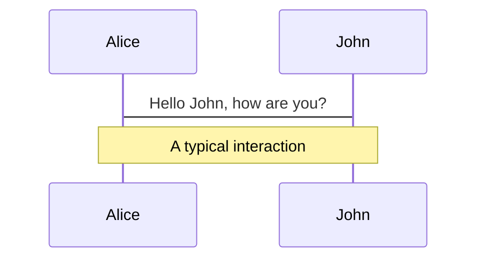
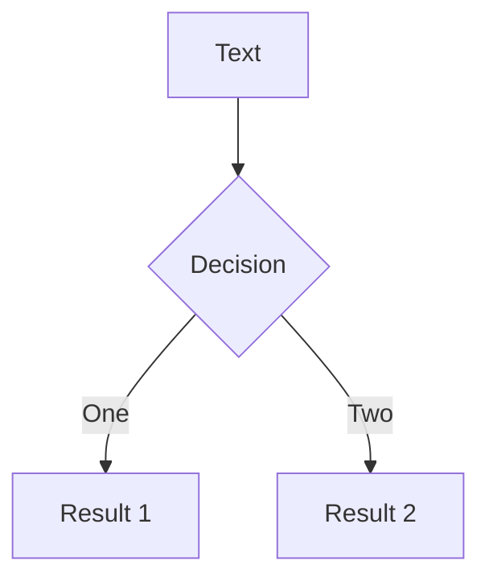
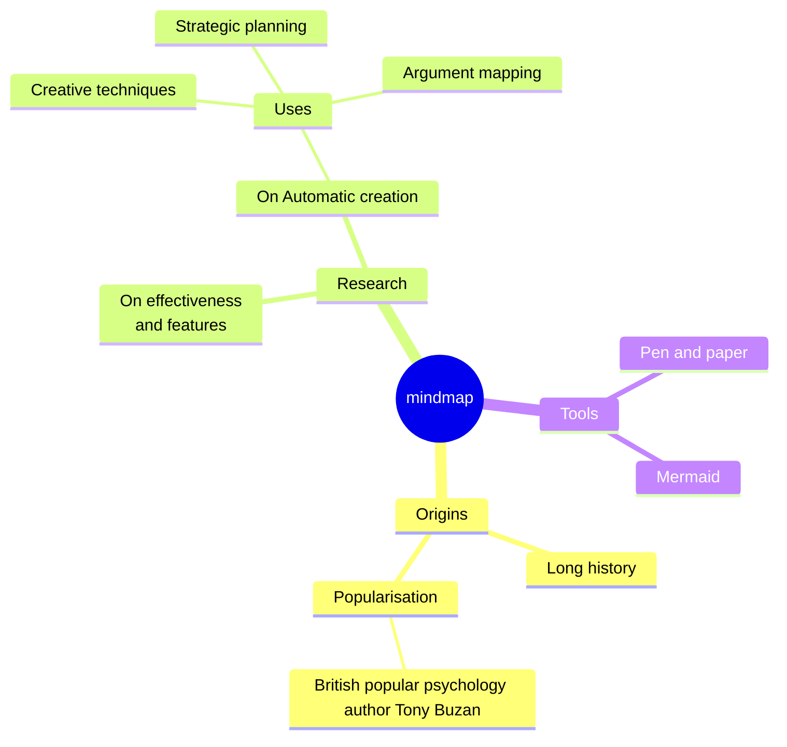
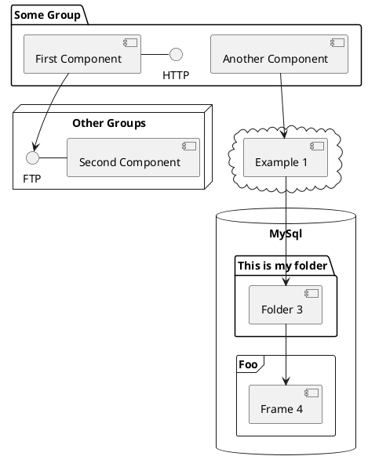

---
# You can also start simply with 'default'
theme: apple-basic
# random image from a curated Unsplash collection by Anthony
# like them? see https://unsplash.com/collections/94734566/slidev
background: https://cover.sli.dev
# some information about your slides (markdown enabled)
title: Case Study
info: |
  ## Healthcare Academy
  Speaker: Tina Chen

# apply unocss classes to the current slide
class: text-center
# https://sli.dev/features/drawing
drawings:
  persist: false
# slide transition: https://sli.dev/guide/animations.html#slide-transitions
transition: slide-up
# enable MDC Syntax: https://sli.dev/features/mdc
mdc: true
---

# Welcome to Slidev

Presentation slides for developers

<div @click="$slidev.nav.next" class="py-1 mt-12" hover:bg="white op-10">
  Press Space for next page <carbon:arrow-right />
</div>

<div class="m-6 text-xl abs-br">
  <button @click="$slidev.nav.openInEditor" title="Open in Editor" class="slidev-icon-btn">
    <carbon:edit />
  </button>
  <a href="https://github.com/slidevjs/slidev" target="_blank" class="slidev-icon-btn">
    <carbon:logo-github />
  </a>
</div>

<!--
The last comment block of each slide will be treated as slide notes. It will be visible and editable in Presenter Mode along with the slide. [Read more in the docs](https://sli.dev/guide/syntax.html#notes)
-->

---
transition: slide-up
class: p-0
layout: full
---

<div class="flex flex-row gap-24 justify-center items-center px-32 py-14 h-full">
  <div class="relative w-1/2">
    <div class="absolute -left-4 -top-8 z-10 w-52">
      <ChatBubble />
    </div>
    
  </div>
  <div class="w-full">
    <p class="font-black">
      We plan to develop an online course system in the future to enhance the platform's usability and meet various needs.
    </p>
    <ul class="text-xs">
      <li>1 Product Designer</li>
      <li>1 Product Manager</li>
      <li>1 Systems Analysis</li>
    </ul>
  </div>
</div>

<script setup lang="ts">
const final = {
  x: 0,
  y: 0,
  rotate: 0,
  scale: 1,
  transition: {
    type: 'spring',
    damping: 10,
    stiffness: 20,
    mass: 2
  }
}
</script>

---
transition: slide-up
class: p-0
layout: full
---

<div class="relative w-40 h-40">
  
  
  
</div>

<script setup lang="ts">
const final = {
  x: 0,
  y: 0,
  rotate: 0,
  scale: 1,
  transition: {
    type: 'spring',
    damping: 10,
    stiffness: 20,
    mass: 2
  }
}
</script>

---
transition: slide-up
class: p-0
layout: full
---

<div class="flex flex-col gap-20 py-14 h-full text-center">
  <p class="text-4xl font-black">Work Experiences</p>
  <div class="flex items-center px-6 py-4 w-full bg-blue-50/70 dark:bg-blue-900">
    <Timeline />
  </div>
</div>

---
transition: slide-left
class: p-0
layout: full
---

<div class="flex flex-col gap-24 px-24 py-14 h-full text-center">
  <p class="text-4xl font-black">About Me</p>
  <div class="grid grid-cols-4 gap-8 items-center">
    <div >
      
      <p>
        About Me
      </p>
    </div>
    <div>
      
      <p>
        About Me
      </p>
    </div>
    <div>
      
      <p>
        About Me
      </p>
    </div>
    <div>
      
      <p>
        About Me
      </p>
    </div>
  </div>
</div>

---
transition: slide-up
class: p-0
layout: full
---

<div class="flex relative flex-row px-14 py-24 h-full">
  <div class="space-y-8 z-1">
    <div class="flex flex-row gap-3 items-center">
      <span class="flex relative w-3 h-3">
        <span class="inline-flex absolute w-full h-full bg-green-400 rounded-full opacity-75 animate-ping"></span>
        <span class="inline-flex relative w-3 h-3 bg-green-500 rounded-full"></span>
      </span>
      <p class="text-sm text-gray-400">
        In Progress
      </p>
    </div>
    <div>
      <p class="pb-8 text-6xl font-black">Healthcare<br><br><br>Academy</p>
      <p class="text-base tracking-wider">
        Taiwan International Medical Education
      </p>
    </div>
  </div>
  <div class="z-1">
    
  </div>
  <!-- Circle -->
  <div 
    v-motion
    :initial="{ x: 200 }"
    :enter="final"
    class="absolute -z-10 bg-blue-50 dark:bg-blue-900 rounded-full w-[700px] aspect-square -top-1/12 -translate-y-1/2 -right-1/5">
  </div>
</div>

<script setup lang="ts">
const final = {
  x: 0,
  y: 0,
  rotate: 0,
  scale: 1,
  transition: {
    type: 'spring',
    damping: 10,
    stiffness: 20,
    mass: 2
  }
}
</script>

<!--
我們目前正在籌建醫療保健學院，專注於台灣國際醫學教育。
該措施旨在提高醫療培訓和教育的可近性。
該平台將提供為醫療保健專業人員設計的各種課程。
隨著我們推出這項重要資源的進展，請繼續關注更新。
-->

---
transition: slide-up
class: p-0
layout: full
---

<div class="flex flex-row gap-64 justify-start items-center px-32 py-14 h-full"> 
  <p class="text-6xl font-black">Agenda</p>
  <ol class="text-sm list-decimal">
    <li>Background</li>
    <li>Research & Define</li>
    <li>Design System</li>
    <li>Feature Demo</li>
  </ol>
  <!-- Circle -->
  <div 
    v-motion
    :initial="{ x: -200 }"
    :enter="final"
    class="absolute -z-10 bg-blue-50 dark:bg-blue-900 rounded-full w-[700px] aspect-square -top-1/12 -translate-y-1/2 -left-1/5">
  </div>
</div>

<script setup lang="ts">
const final = {
  x: 0,
  y: 0,
  rotate: 0,
  scale: 1,
  transition: {
    type: 'spring',
    damping: 10,
    stiffness: 20,
    mass: 2
  }
}
</script>

---
transition: slide-up
class: p-0
layout: full
---

<div class="flex flex-col justify-between p-14 h-full"> 
  <div class="space-y-2">
    <p class="text-xl font-black">Background</p>
    <p class="text-sm">
      This platform is designed to provide a comprehensive overview of Taiwan's medical and health training courses and achievements for foreign medical professionals. It also offers more complete training information and application services through the platform.
    </p>
  </div>
  <div class="grid grid-cols-4 gap-6">
    <div class="space-y-2">
      <p class="text-xl font-black">Role</p>
      <ul class="text-xs">
        <li>UI/UX Designer</li>
        <li>Product Roadmap</li>
      </ul>
    </div>
    <div class="space-y-2">
      <p class="text-xl font-black">Team</p>
      <ul class="text-xs">
        <li>1 Product Designer</li>
        <li>1 Product Manager</li>
        <li>1 Systems Analysis</li>
        <li>1 Front-end Developer</li>
        <li>3 Back-end Developer</li>
      </ul>
    </div>
    <div class="space-y-2">
      <p class="text-xl font-black">Timeline</p>
      <p class="text-xs">
        More than 1 year
        <br>
        <span class="text-gray-400">
          (2023.10 - Now)
        </span>
      </p>
    </div>
    <div class="space-y-2">
      <p class="text-xl font-black">Company</p>
      <p class="text-xs">
        Joint Commission of Taiwan
      </p>
    </div>
  </div>
</div>

<!--
該平台旨在為外國醫療專業人員提供台灣醫療保健培訓課程的全面概覽。
它還提供全面的培訓資訊和應用服務，以提升用戶體驗。
這裡強調的角色是 UI/UX 設計師，專注於產品路線圖。
該團隊由各種角色組成，包括產品設計師、經理、系統分析師和開發人員。
該計畫的時間跨度一年多，從2023年10月開始至今。
這項倡議由台灣聯委會負責，強調其可信度和支持。
-->

---
transition: slide-up
class: p-0
layout: full
---

<div class="flex flex-col justify-between p-14 h-full"> 
  <div class="space-y-2">
    <p class="text-xl font-black">Design Flow</p>
    <p class="text-sm">
      In this project, I focused on designing the overall website architecture to ensure users could browse courses and complete the registration process. My primary responsibility was to plan an online course registration system that is user-friendly and allows users to verify their application results. 
      <br>
      <br>
      The goal of the platform is to foster closer medical exchange and collaboration with other countries, promoting the bidirectional sharing of knowledge and skills.
    </p>
  </div>
  <div class="grid grid-cols-4 gap-6">
    <div class="space-y-2">
      <p class="text-xl font-black">Research</p>
      <ul class="text-xs">
        <li>Website IA</li>
        <li>Course Information Display Requirements</li>
        <li>Course Registration and Review System</li>
      </ul>
    </div>
    <div class="space-y-2">
      <p class="text-xl font-black">Define</p>
      <ul class="text-xs">
        <li>Website Design Specifications</li>
        <li>Online Course Registration Workflow</li>
        <li>Online Course Registration Review Process</li>
        <li>Web/App Editor Compatibility</li>
      </ul>
    </div>
    <div class="space-y-2">
      <p class="text-xl font-black">Design</p>
      <ul class="text-xs">
        <li>Component Design</li>
        <li>Website UI Design</li>
        <li>Responsive Website Compatibility</li>
      </ul>
    </div>
    <div class="space-y-2">
      <p class="text-xl font-black">Company</p>
      <ul class="text-xs">
        <li>Testing & Collect Feedback</li>
      </ul>
    </div>
  </div>
</div>

<!--
在這個專案中，我專注於創建一個用戶友好的網站架構，用於課程瀏覽和註冊。
我的主要任務是設計一個線上課程註冊系統，讓使用者驗證他們的申請結果。
該平台旨在加強國際醫療交流與合作，促進知識與技能的分享。
我們將探討此專案涉及的研究、定義、設計和測試階段。
-->

---
transition: slide-up
class: p-0
layout: full
---

<div class="flex flex-col justify-between p-14 h-full"> 
  <p class="text-xl font-black">
  ☹️ User Pain Point
  </p>
  <div class="grid grid-cols-3 gap-y-3 gap-x-12">
    <div class="">
      <p class="text-lg font-black">Hospital publicity is weak</p>
      <p class="text-xs">
        The hospital's authoritative departments are fully equipped but take a more low-profile approach in promotion.
      </p>
    </div>
    <div class="">
      <p class="text-lg font-black">Insufficient training information</p>
      <p class="text-xs">
        Training information is insufficient, making it difficult to clearly understand the overall application process.
      </p>
    </div>
    <div class="">
      <p class="text-lg font-black">Customized training programs</p>
      <p class="text-xs">
        Overseas healthcare personnel have clear learning goals and require customized training programs.
      </p>
    </div>
    <div class="">
      <p class="text-lg font-black">Issues with document resubmission</p>
      <p class="text-xs">
        The process of submitting supplementary documents is time-consuming, labor-intensive, and disorganized.
      </p>
    </div>
    <div class="">
      <p class="text-lg font-black">Training results and evaluations</p>
      <p class="text-xs">
        Overseas personnel find it difficult to access training results and evaluations, making it challenging to showcase training achievements externally.
      </p>
    </div>
  </div>
</div>

<!--
讓我們討論一下我們在醫療保健領域發現的一些關鍵用戶痛點。
一是醫院宣傳力道薄弱。儘管部門配備齊全，但在晉升方面卻有低調的傾向。
接下來，我們遇到了文件重新提交的問題。這個過程非常耗時、勞力密集型，而且往往雜亂無章。
此外，可用的培訓資訊不足，導致使用者難以理解整個申請流程。
最後，海外醫護人員需要客製化培訓計劃，以有效實現他們明確的學習目標。
-->

---
transition: slide-up
class: p-0
layout: full
---

<div class="grid grid-cols-2 items-center p-14 h-full"> 
  <p class="text-6xl font-black">Our Goal</p>
  <ol class="text-sm list-decimal">
    <li>Establish a registration system that includes authentication</li>
    <li>Integrate course resources from national medical institutions</li>
    <li>Provide multi-language switch for the website</li>
    <li>Provide course classification and filtering functions</li>
    <li>Provide individual and group registration functions for courses</li>
    <li>Allow participants to view the registration review results</li>
    <li>Students can consult with the course provider online</li>
  </ol>
</div>

<!--
我們的目標是建立一個全面的註冊系統，包括用戶身份驗證。
我們旨在整合全國醫療機構的課程資源，提升學習體驗。
網站將提供多語言切換，確保不同受眾的可訪問性。
我們將實現課程分類和過濾功能，幫助使用者輕鬆找到相關課程。
課程將提供個人和團體註冊功能，以滿足不同的需求。
參與者將能夠查看其註冊審核結果以確保透明度。
此外，學生將能夠在線上諮詢課程提供者以獲得支援和指導。
-->

---
transition: slide-up
class: p-0
layout: full
---

<div class="grid grid-cols-2 items-center p-14 h-full"> 
  <p class="text-6xl font-black">Solution</p>
  <ol class="text-sm list-decimal">
    <li>Display course training evaluation results</li>
    <li>Provide course information and filtering functions</li>
    <li>Design a document upload and automatic verification system</li>
    <li>Establish a multilingual frameworks</li>
    <li>Create a dual registration mode with dynamic forms</li>
    <li>Develop a registration status tracking feature</li>
  </ol>
</div>

<!--
讓我們討論一下我們的培訓評估系統的建議解決方案。
首先，我們旨在有效展示課程訓練評估結果。
接下來，我們將提供全面的課程資訊以及過濾功能，以提供更好的使用者體驗。
此外，我們計劃設計一個包含自動驗證的文檔上傳系統。
建立多語言框架將確保不同使用者的可訪問性。
最後，我們將建立一個以動態表單為特色的雙重註冊模式，並開發註冊狀態追蹤功能。
-->

---
transition: slide-left
class: p-0
layout: full
---

<div class="grid grid-cols-2 items-center h-full"> 
  <div class="p-14 space-y-2">
    <p class="text-2xl font-black">💬 Some impacts on the project</p>
    <ol class="text-sm list-decimal">
      <li>The client was unable to provide clear requirements</li>
      <li>The project architecture was extensive</li>
      <li>The development timeline was tight</li>
    </ol>
  </div>
  
</div>

<!--
讓我們討論一下我們遇到的對專案的一些影響。
首先，客戶無法提供明確的需求，導致了一些混亂。
此外，專案架構非常廣泛，比預期更加複雜。
最後，我們面臨緊迫的開發時間，這給團隊增加了壓力。
-->

---
transition: slide-up
class: p-0
layout: full
---

<div class="grid grid-cols-2 items-center p-14 h-full"> 
  <p class="text-6xl font-black leading-loose">Research<br><br><br>&<br><br><br>Define</p>
  <div>
    <p>
      After analyzing user needs and the functional architecture, I set 2 design directions for the project:
    </p>
    <ol class="text-sm list-decimal">
      <li>
        Target Audience-Oriented
        <br>
        <span>
          <ul class="text-gray-500">
            <li>Courses categorized by professional fields.</li>
            <li>The color selection is composed of stable and medical tones.</li>
          </ul>
        </span>
      </li>
      <li>
        Enhancing User Experience
        <br>
        <span>
          <ul class="text-gray-500">
            <li>Provide custom search and filter options.</li>
            <li>A registration process that is easy to complete.</li>
            <li>Convenient visibility of the review status.</li>
          </ul>
        </span>
      </li>
    </ol>
  </div>
</div>

<!--
我們從研究和定義階段開始，這對於為我們的專案奠定堅實的基礎至關重要。
在分析了使用者需求和功能架構之後，我確定了兩個關鍵的設計方向。
第一個方向以目標受眾為導向，確保課程按專業領域分類，在色彩選擇上使用穩定的醫學色調。
第二個方向強調增強使用者體驗，包括提供自訂搜尋和過濾選項、簡單的註冊過程以及方便地查看審核狀態。
-->

---
transition: slide-up
class: p-0
layout: full
---

<div class="flex flex-col gap-16 items-center p-14 h-full text-center"> 
  <p class="text-2xl font-black">Training Course Categories</p>
  <Course />
</div>

<!--
今天，我們將探討可用的各種培訓課程類別。
我們提供普通課程，包括醫療保健專業課程和綜合創新課程，均以現場、線上和混合形式提供。
在醫療專業知識象限中，我們專注於臨床培訓計劃，提供現場和混合形式。
每個課程都旨在滿足不同的學習偏好和專業需求。 
讓我們更深入地了解每個類別提供的內容以及它們如何使您受益。
-->

---
transition: slide-left
class: p-0
layout: full
---

<div class="flex flex-col justify-between p-14 h-full"> 
  <div class="space-y-2">
    <p class="text-xl font-black">Competitive Analysis</p>
    <p class="text-sm">
      I researched products on the market with similar course registration features but did not find a suitable example.
    </p>
  </div>
  <div class="grid grid-cols-3 gap-y-6 gap-x-32">
    <div class="space-y-3 text-center">
      <div class="overflow-hidden rounded-2xl border border-gray-100 aspect-video">
        
      </div>
      <p class="text-sm font-black">Hahow</p>
    </div>
    <div class="space-y-3 text-center">
      <div class="overflow-hidden rounded-2xl border border-gray-100 aspect-video">
        
      </div>
      <p class="text-sm font-black">Udemy</p>
    </div>
    <div class="space-y-3 text-center">
      <div class="overflow-hidden rounded-2xl border border-gray-100 aspect-video">
        
      </div>
      <p class="text-sm font-black">Coursera</p>
    </div>
    <div class="space-y-3 text-center">
      <div class="overflow-hidden rounded-2xl border border-gray-100 aspect-video">
        
      </div>
      <p class="text-sm font-black">Future Learn</p>
    </div>
    <div class="space-y-3 text-center">
      <div class="overflow-hidden rounded-2xl border border-gray-100 aspect-video">
        
      </div>
      <p class="text-sm font-black">Techable</p>
    </div>
    <div class="space-y-3 text-center">
      <div class="overflow-hidden rounded-2xl border border-gray-100 aspect-video">
        
      </div>
      <p class="text-sm font-black">Klook</p>
    </div>
  </div>
</div>

<!--
今天，我們將討論有關課程註冊功能的競爭分析。
我對市場上的各種產品進行了深入研究，但沒有找到滿足我們需求的合適範例。
受審查的平台包括 Hahow、Udemy、Future Learn、Coursera、Techable 和 Klook。
這些平台中的每一個都提供獨特的功能，但沒有一個與我們正在尋找的功能完美契合。
-->

---
transition: slide-up
class: p-0
layout: full
---

<div class="flex flex-row justify-between items-center p-14 h-full"> 
  <p class="text-4xl font-black">Information<br><br>Architecture</p>
  
</div>

<!--
今天，我們將討論資訊架構的概念。
此圖說明了我們系統內資訊的結構和組織。
每個部分代表不同的組件及其關係，這對於使用者導航和體驗至關重要。
了解這種架構有助於我們提高可用性並確保用戶可以輕鬆找到他們需要的內容。
-->

---
transition: slide-up
class: p-0
layout: full
---

<div class="h-full text-center"> 
  
  <p class="text-2xl font-black">User flow for registering for a course</p>
</div>

<!--
讓我們討論一下註冊課程的使用者流程。
此流程概述了使用者從課程頁面到提交申請所採取的步驟。
關鍵操作包括申請、登入和註冊。
請注意根據使用者的回應指導使用者的決策點。
了解此流程有助於我們改善使用者體驗並簡化註冊流程。
-->

---
transition: slide-up
class: p-0
layout: full
---

<div class="flex flex-row gap-64 justify-start items-center px-32 py-14 h-full"> 
  <p class="text-6xl font-black">Design<br><br><br>System</p>
  <ul class="text-sm">
    <li>Variable settings</li>
    <li>Multilingual settings</li>
    <li>Figma design files</li>
    <li>Storybook management</li>
  </ul>
  <!-- Circle -->
  <div 
    v-motion
    :initial="{ x: -200 }"
    :enter="final"
    class="absolute -z-10 bg-blue-50 dark:bg-blue-900 rounded-full w-[700px] aspect-square -top-1/12 -translate-y-1/2 -left-1/5">
  </div>
</div>

<script setup lang="ts">
const final = {
  x: 0,
  y: 0,
  rotate: 0,
  scale: 1,
  transition: {
    type: 'spring',
    damping: 10,
    stiffness: 20,
    mass: 2
  }
}
</script>

---
transition: slide-up
class: p-0
layout: full
---

<div class="grid grid-cols-4 gap-4 h-full">
  <div class="flex flex-col col-span-1 justify-between px-10 py-6 h-full">
    <!-- 左邊內容 -->
    <p class="text-4xl font-black">Variable<br><br>Settings</p>
    <p class="text-xs text-gray-500">
      The project is developed using <span v-mark.circle.orange>Tailwind</span>. 
      <br>
      <br>
      I set up the variables in the files, allowing engineers to directly view the relevant class settings during development.
    </p>
  </div>
  <div class="flex col-span-3 items-center px-10 h-full bg-gray-200">
    <!-- 右邊內容 -->
    
  </div>
</div>

<!--
本投影片重點介紹我們使用 Tailwind 開發的專案中的變數設定。
我們組織了各種變量，包括間距、圓邊、邊框、容器和顏色。
透過在文件中設定這些變量，我們使工程師能夠在開發過程中輕鬆存取和查看相關的類別設定。
這種方法簡化了工作流程並增強了設計和工程團隊之間的協作。
-->

---
transition: slide-up
class: p-0
layout: full
---

<div class="grid grid-cols-4 gap-4 h-full">
  <div class="flex flex-col col-span-1 justify-between px-10 py-6 h-full">
    <!-- 左邊內容 -->
    <p class="text-4xl font-black">Variable<br><br>Settings</p>
    <p class="text-xs text-gray-500">
      The project is developed using Tailwind. 
      <br>
      <br>
      I set up the variables in the files, allowing engineers to directly view the relevant class settings during development.
    </p>
  </div>
  <div class="flex col-span-3 items-center px-10 h-full bg-gray-200">
    <!-- 右邊內容 -->
    <Video
      src="https://tinaaa071.github.io/Case-Study-ppt/video1.mp4"
    />
  </div>
</div>

<!--
讓我們討論一下我們的專案的變數設置，該專案是使用 Tailwind 開發的。
我在文件中設定了變數以簡化工程師的流程。
此設定允許他們在開發過程中直接查看相關的類別設定。
這種方法提高了效率，並確保每個人在設計元素方面都達成共識。
-->

---
transition: slide-up
class: p-0
layout: full
---

<div class="grid grid-cols-4 gap-4 h-full">
  <div class="flex flex-col col-span-1 justify-between px-10 py-6 h-full">
    <!-- 左邊內容 -->
    <p class="text-4xl font-black">i18n<br><br>Settings</p>
    <p class="text-xs text-gray-500">
      I set up multilingual variables, allowing for direct switching and viewing in the files during development.
    </p>
  </div>
  <div class="flex col-span-3 items-center px-10 h-full bg-gray-200">
    <!-- 右邊內容 -->
    
  </div>
</div>

<!--
今天，我們將討論 i18n 設定及其在我們的開發過程中的重要性。
我設定了多語言變量，方便直接切換和查看不同語言的內容。
這種方法可以實現更簡化的工作流程，特別是在處理需要在地化的專案時。
所示表格說明了英文和中文的變量，突顯了存取不同語言設定的便利性。
-->

---
transition: slide-up
class: p-0
layout: full
---

<div class="grid grid-cols-4 gap-4 h-full">
  <div class="flex flex-col col-span-1 justify-between px-10 py-6 h-full">
    <!-- 左邊內容 -->
    <p class="text-4xl font-black">i18n<br><br>Settings</p>
    <p class="text-xs text-gray-500">
      I set up multilingual variables, allowing for direct switching and viewing in the files during development.
    </p>
  </div>
  <div class="flex col-span-3 items-center px-10 h-full bg-gray-200">
    <!-- 右邊內容 -->
    <Video
      src="https://tinaaa071.github.io/Case-Study-ppt/video2.mp4"
    />
  </div>
</div>

<!--
讓我們討論一下我們專案的 i18n 設定。
我設定了多語言變量，方便開發時在文件中直接切換和查看。
這種方法增強了我們滿足不同使用者需求的能力並提高了可訪問性。
透過實施這些設置，我們可以確保不同語言的使用者獲得更流暢的體驗。
-->

---
transition: slide-up
class: p-0
layout: full
---

<div class="grid grid-cols-4 gap-4 h-full">
  <div class="flex flex-col col-span-1 justify-between px-10 py-6 h-full">
    <!-- 左邊內容 -->
    <p class="text-4xl font-black">Figma<br><br>Design<br><br>Files</p>
    <p class="text-xs text-gray-500">
      I defined the design system and components in the file, including their usage scenarios and states.
    </p>
  </div>
  <div class="flex col-span-3 items-center px-10 h-full bg-gray-200">
    <!-- 右邊內容 -->
    <Video
      src="https://tinaaa071.github.io/Case-Study-ppt/video3.mp4"
    />
  </div>
</div>

<!--
今天，我們將討論 Figma 設計文件及其在我們工作流程中的重要性。
我已經在這些文件中定義了設計系統及其元件。
這包括每個組件的詳細使用情境和狀態。
利用 Figma 可以實現我們專案之間更好的協作和一致性。
-->

---
transition: slide-up
class: p-0
layout: full
---

<div class="grid grid-cols-4 gap-4 h-full">
  <div class="flex flex-col col-span-1 justify-between px-10 py-6 h-full">
    <!-- 左邊內容 -->
    <p class="text-4xl font-black">Figma<br><br>Design<br><br>Files</p>
    <p class="text-xs text-gray-500">
      I showcased the dimensions of different pages in the files and defined various scenarios and workflows.
    </p>
  </div>
  <div class="flex col-span-3 items-center px-10 h-full bg-gray-200">
    <!-- 右邊內容 -->
    <Video
      src="https://tinaaa071.github.io/Case-Study-ppt/video4.mp4"
    />
  </div>
</div>

<!--
今天，我們將討論 Figma 設計文件及其在我們工作流程中的重要性。
我展示了這些文件中不同頁面的尺寸。
定義各種場景和工作流程對於增強我們的設計流程至關重要。
了解這些要素將有助於簡化協作並提高效率。
-->

---
transition: slide-up
class: p-0
layout: full
---

<div class="grid grid-cols-4 gap-4 h-full">
  <div class="flex flex-col col-span-1 justify-between px-10 py-6 h-full">
    <!-- 左邊內容 -->
    <p class="text-4xl font-black">Storybook</p>
    <p class="text-xs text-gray-500">
      I used Storybook as a platform for visual guidelines and component demonstrations, assisting the development team in referencing concrete design standards during implementation.
    </p>
  </div>
  <div class="flex col-span-3 items-center px-10 h-full bg-gray-200">
    <!-- 右邊內容 -->
    <a href="https://main--6758f1bddc4388960f8ac32f.chromatic.com/?path=/story/guides-color--color-list" target="_blank" class="overflow-hidden rounded-2xl transition-all duration-300 ease-in-out group hover:shadow-lg">
      
    </a>
  </div>
</div>

<style>
.slidev-layout a {
  border-style: none;
}
</style>

<!--
Storybook 是視覺指南和組件演示的重要平台。
它協助開發團隊在實施過程中參考具體的設計標準。
此介面允許輕鬆瀏覽組件及其屬性。
該工具透過提供清晰的範例來增強設計人員和開發人員之間的協作。
-->

---
transition: slide-up
class: p-0
layout: full
---

<div class="flex flex-row gap-64 justify-start items-center px-32 py-14 h-full"> 
  <p class="text-6xl font-black">Feature<br><br><br>Demo</p>
  <ul class="text-sm">
    <li>Signup</li>
    <li>Course Categories</li>
    <li>Course Page</li>
    <li>Course Enrollment</li>
    <li>Apply Review Progress</li>
    <li>Online Consultation</li>
  </ul>
  <!-- Circle -->
  <div 
    v-motion
    :initial="{ x: -200 }"
    :enter="final"
    class="absolute -z-10 bg-blue-50 dark:bg-blue-900 rounded-full w-[700px] aspect-square -top-1/12 -translate-y-1/2 -left-1/5">
  </div>
</div>

<script setup lang="ts">
const final = {
  x: 0,
  y: 0,
  rotate: 0,
  scale: 1,
  transition: {
    type: 'spring',
    damping: 10,
    stiffness: 20,
    mass: 2
  }
}
</script>

<!--
今天，我們將展示我們平台的一些關鍵功能。
首先，我們將看看註冊過程，該過程旨在用戶友好。
接下來，我們將探索課程類別，提供一種結構化的方式來瀏覽我們的課程。
然後，我們將深入了解課程頁面，突出顯示其功能和佈局。
之後，我們將討論課程註冊以及它如何簡化註冊過程。
最後，我們將介紹「應用審核進度」和「線上諮詢」功能，以增強用戶參與度和支援。
-->

---
transition: slide-up
class: p-0
layout: full
---

<div class="grid grid-cols-4 gap-4 h-full">
  <div class="flex flex-col col-span-1 justify-between px-10 py-6 h-full">
    <!-- 左邊內容 -->
    <p class="text-4xl font-black">Signup</p>
    <p class="text-xs text-gray-500">
      Use <span v-mark.underline.orange>dynamic switching</span> to toggle between different forms, catering to different user registrations while maintaining a unified design and reducing additional development efforts.
    </p>
  </div>
  <div class="flex col-span-3 justify-center items-center px-10 py-12 h-full bg-gray-200">
    <!-- 右邊內容 -->
    
  </div>
</div>

<!--
註冊過程旨在用戶友好且高效。
我們利用動態切換來適應不同的使用者類型，確保流暢的註冊體驗。
這種方法使我們能夠保持統一的設計，同時最大限度地減少額外的開發工作。
用戶可以選擇使用 Google 或 Facebook 帳戶進行註冊，以更加方便。
-->

---
transition: slide-up
class: p-0
layout: full
---

<div class="grid grid-cols-4 gap-4 h-full">
  <div class="flex flex-col col-span-1 justify-between px-10 py-6 h-full">
    <!-- 左邊內容 -->
    <p class="text-4xl font-black">Signup</p>
    <p class="text-xs text-gray-500">
      Dynamically display fields based on different options.
    </p>
  </div>
  <div class="overflow-hidden bg-cover bg-center bg-no-repeat flex col-span-3 justify-center items-center h-full bg-gray-200 bg-[url('https://i.imgur.com/kxCbId4.png')]">
    <!-- 右邊內容 -->
    
    
  </div>
</div>

<!--
今天，我們重點關注我們平台的註冊流程。
該表單包含基本字段，例如姓名、姓氏和密碼。
使用者也可以選擇自己的專業，系統會根據他們的選擇動態調整欄位。
這種靈活性確保醫療保健和非醫療保健專業人員都可以有效地完成註冊。
請記住在提交表格之前查看條款和隱私權政策。
-->

---
transition: slide-up
class: p-0
layout: full
---

<div class="grid grid-cols-4 gap-4 h-full">
  <div class="flex flex-col col-span-1 justify-between px-10 py-6 h-full">
    <!-- 左邊內容 -->
    <p class="text-4xl font-black">Signup</p>
    <p class="text-xs text-gray-500">
      Integrate API data to enable real-time validation, reducing manual review time.
    </p>
  </div>
  <div class="flex col-span-3 justify-center items-center px-10 py-12 h-full bg-gray-200">
    <!-- 右邊內容 -->
    
  </div>
</div>

<!--
註冊過程對於用戶有效建立帳戶至關重要。
確保準確填寫所有必填欄位以避免錯誤。
API 資料的整合可以進行即時驗證，從而簡化了流程。
此功能大大減少了人工審核的需要，並提高了效率。
提交前請務必仔細檢查機構代碼和其他關鍵資訊。
-->

---
transition: slide-up
class: p-0
layout: full
---

<div class="grid grid-cols-4 gap-4 h-full">
  <div class="flex flex-col col-span-1 justify-between px-10 py-6 h-full">
    <!-- 左邊內容 -->
    <p class="text-4xl font-black">Course<br><br>Categories</p>
    <p class="text-xs text-gray-500">
      Provide a collapsible filter that allows filtering by different criteria.
      <br>
      <br>
      Courses are designed in card format, with key information displayed, allowing users to easily view required items in real time.
    </p>
  </div>
  <div class="flex col-span-3 items-center px-10 h-full bg-gray-200">
    <!-- 右邊內容 -->
    <Video
      src="https://tinaaa071.github.io/Case-Study-ppt/video5.mp4"
    />
  </div>
</div>

<!--
讓我們討論一下增強使用者導航的課程類別功能。
此功能包括一個可折疊過濾器，可讓使用者根據各種標準對課程進行排序。
課程以卡片形式呈現，基本資訊一目了然。
此設計旨在透過輕鬆即時存取相關課程詳細資訊來改善用戶體驗。
-->

---
transition: slide-up
class: p-0
layout: full
---

<div class="grid grid-cols-4 gap-4 h-full">
  <div class="flex flex-col col-span-1 justify-between px-10 py-6 h-full">
    <!-- 左邊內容 -->
    <div class="flex flex-col">
      <p class="text-4xl font-black">Course<br><br>Page</p>
      <p class="text-xl font-black text-blue-500">Key Design</p>
    </div>
    <p class="text-xs text-gray-500">
      Users can instantly switch between information for easy and quick content search.
    </p>
  </div>
  <div class="flex col-span-3 items-center px-10 h-full bg-gray-200">
    <!-- 右邊內容 -->
    <Video
      src="https://tinaaa071.github.io/Case-Study-ppt/video6.mp4"
    />
  </div>
</div>

<!--
今天，我們重點關注課程頁面及其關鍵設計元素。
該頁面允許用戶輕鬆導航和訪問有關課程的重要資訊。
請注意使用者如何在不同部分之間無縫切換以快速檢索內容。
該設計強調清晰度和可訪問性，增強整體用戶體驗。
-->

---
transition: slide-up
class: p-0
layout: full
---

<div class="grid grid-cols-4 gap-4 h-full">
  <div class="flex flex-col col-span-1 justify-between px-10 py-6 h-full">
    <!-- 左邊內容 -->
    <div class="flex flex-col">
      <span class="px-2 py-1 text-xs text-white bg-gray-400 rounded-full w-fit">
        Personal
      </span>
      <p class="text-4xl font-black">Course<br><br>Enrollment</p>
      <p class="text-xl font-black text-blue-500">Key Design</p>
    </div>
    <p class="text-xs text-gray-500">
      Displays the registration stage with a <span v-mark.underline.orange>progress bar</span>, dividing the steps to avoid a lengthy filling process.
    </p>
  </div>
  <div class="flex col-span-3 items-center px-10 h-full bg-gray-200">
    <!-- 右邊內容 -->
    <Video
      src="https://tinaaa071.github.io/Case-Study-ppt/video7.mp4"
    />
  </div>
</div>

<!--
今天，我們將討論課程註冊流程及其關鍵設計要素。
介面顯示註冊階段並帶有清晰的進度條，有助於簡化使用者體驗。
這種設計有效地劃分了步驟，使用戶更容易導航，而不會感到不知所措。
我們的目標是簡化填寫流程並提高註冊期間的用戶滿意度。
-->

---
transition: slide-up
class: p-0
layout: full
---

<div class="grid grid-cols-4 gap-4 h-full">
  <div class="flex flex-col col-span-1 justify-between px-10 py-6 h-full">
    <!-- 左邊內容 -->
    <div class="flex flex-col">
      <span class="px-2 py-1 text-xs text-white bg-gray-400 rounded-full w-fit">
        Group
      </span>
      <p class="text-4xl font-black">Course<br><br>Enrollment</p>
      <p class="text-xl font-black text-blue-500">Key Design</p>
    </div>
    <p class="text-xs text-gray-500">
      Dynamically adjust the fields to a group registration mode based on the <span v-mark.underline.orange>number</span> of selected courses.
    </p>
  </div>
  <div class="flex col-span-3 items-center px-10 h-full bg-gray-200">
    <!-- 右邊內容 -->
    <Video
      src="https://tinaaa071.github.io/Case-Study-ppt/video8.mp4"
    />
  </div>
</div>

<!--
今天，我們將討論課程註冊流程及其關鍵設計要素。
此介面允許用戶根據註冊人數動態調整欄位。
這種靈活性透過簡化群組註冊來增強使用者體驗。
我們的目標是讓所有用戶的註冊過程直觀且有效率。
-->

---
transition: slide-up
class: p-0
layout: full
---

<div class="grid grid-cols-4 gap-4 h-full">
  <div class="flex flex-col col-span-1 justify-between px-10 py-6 h-full">
    <!-- 左邊內容 -->
    <p class="text-4xl font-black">Apply<br><br>Review<br><br>Progress</p>
    <p class="text-xs text-gray-500">
      Students can switch between different statuses to view the approval progress of their registered courses. Clicking on the card will display detailed information.
    </p>
  </div>
  <div class="flex col-span-3 items-center px-10 h-full bg-gray-200">
    <!-- 右邊內容 -->
    <Video
      src="https://tinaaa071.github.io/Case-Study-ppt/video9.mp4"
    />
  </div>
</div>

<!--
該介面允許學生申請課程、查看其狀態並追蹤進度。
學生可以輕鬆切換不同狀態，查看註冊課程的審批進度。
點擊特定課程卡將提供有關該課程的詳細資訊。
這種簡化的流程增強了使用者體驗，並使學生了解他們的申請。
-->

---
transition: fade-out
class: p-0
layout: full
---

<div class="grid grid-cols-4 gap-4 h-full">
  <div class="flex flex-col col-span-1 justify-between px-10 py-6 h-full">
    <!-- 左邊內容 -->
    <div class="flex flex-col">
      <p class="text-4xl font-black">Online<br><br>Consult</p>
      <p class="text-xl font-black text-blue-500">Key Design</p>
    </div>
    <p class="text-xs text-gray-500">
      We provide an online consultation system, allowing students to instantly contact the course organizers to address related issues.
    </p>
  </div>
  <div class="flex col-span-3 items-center px-10 h-full bg-gray-200">
    <!-- 右邊內容 -->
    <Video
      src="https://tinaaa071.github.io/Case-Study-ppt/video10.mp4"
    />
  </div>
</div>

<!--
今天，我們正在討論我們的線上諮詢功能，這是我們平台的關鍵設計元素。
該系統使學生可以輕鬆地與課程組織者聯繫以獲得即時幫助。
它透過提供對任何相關問題的快速支援來增強整體用戶體驗。
我們的目標是簡化溝通並確保學生觸手可及獲得所需的資源。
-->

---
transition: fade-out
class: p-0
layout: full
---

<div class="grid grid-cols-2 items-center p-14 h-full"> 
  <p class="text-5xl font-black leading-loose">Continuous<br><br><br>Optimization</p>
  <ol class="space-y-8 text-base">
      <li class="font-black">
        Course Feature Expansion
        <br>
        <p class="text-xs font-normal">
          We plan to develop an online course system in the future to enhance the platform's usability and meet various needs.
        </p>
      </li>
      <li class="font-black">
        Improvement of the Course Registration Process
        <br>
        <p class="text-xs font-normal">
          I am still working on improving the course registration process design, particularly in providing users with a smooth experience for handling large amounts of data input.
        </p>
      </li>
      <li class="font-black">
        Online Consultation System
        <br>
        <p class="text-xs font-normal">
          Currently relying on manual responses, we aim to provide some basic intelligent customer support to alleviate issues caused by insufficient staff.
        </p>
      </li>
    </ol>
</div>

<!--
持續優化是增強我們平台可用性的關鍵。
我們正在計劃開發一個線上課程系統，以更好地滿足用戶需求。
課程註冊流程的改進正在進行中，重點是為管理大數據輸入的用戶提供更流暢的體驗。
此外，我們的目標是實施線上諮詢系統，提供基本的智慧客戶支持，解決人員不足的問題。
-->

---
class: p-0
layout: full
---

<div class="flex relative flex-col justify-center items-center p-14 h-full"> 
  <p class="text-3xl font-black leading-loose">Thank You</p>
  <div class="text-sm tracking-wide text-gray-400">
    <a href="https://tina-profolio.vercel.app/" target="_blank" class="">
      Portfolio
    </a>
    <span>|</span>
    <a href="https://medium.com/@tina.uiux" target="_blank" class="">
      Medium
    </a>
    <span>|</span>
    <a href="https://www.figma.com/community/plugin/1420953914431407843/shape-mask" target="_blank" class="">
      Figma Plugin
    </a>
  </div>
  <!-- Circle -->
  <div 
    v-motion
    :initial="{ x: 200 }"
    :enter="final"
    class="absolute -z-10 bg-blue-50 dark:bg-blue-900 rounded-full w-[700px] aspect-square -top-1/12 -translate-y-1/2 -right-1/5">
  </div>
  <div 
    v-motion
    :initial="{ x: -200 }"
    :enter="final"
    class="absolute -z-10 bg-blue-50 dark:bg-blue-900 rounded-full w-[700px] aspect-square -top-1/12 -translate-y-1/2 -left-1/5">
  </div>
</div>

<script setup lang="ts">
const final = {
  x: 0,
  y: 0,
  rotate: 0,
  scale: 1,
  transition: {
    type: 'spring',
    damping: 10,
    stiffness: 20,
    mass: 2
  }
}
</script>

<style>
.slidev-layout a {
  border-style: none;
  transition: color 0.3s ease-in-out;
}

.slidev-layout a:hover {
  color: #60a5fa;
}
</style>

---
transition: slide-left
---

# Hello?

Slidev is a slides maker and presenter designed for developers, consist of the following features.

- 📝 **Text-based** - focus on the content with Markdown, and then style them later
- 🎨 **Themable** - themes can be shared and re-used as npm packages
- 🧑‍💻 **Developer Friendly** - code highlighting, live coding with autocompletion
- 🤹 **Interactive** - embed Vue components to enhance your expressions
- 🎥 **Recording** - built-in recording and camera view
- 📤 **Portable** - export to PDF, PPTX, PNGs, or even a hostable SPA
- 🛠 **Hackable** - virtually anything that's possible on a webpage is possible in Slidev
<br>
<br>

Read more about [Why Slidev?](https://sli.dev/guide/why)

<!--
You can have `style` tag in markdown to override the style for the current page.
Learn more: https://sli.dev/features/slide-scope-style
-->

<style>
h1 {
  background-color: #2B90B6;
  background-image: linear-gradient(45deg, #4EC5D4 10%, #146b8c 20%);
  background-size: 100%;
  -webkit-background-clip: text;
  -moz-background-clip: text;
  -webkit-text-fill-color: transparent;
  -moz-text-fill-color: transparent;
}
</style>

<!--
Here is another comment.
-->

---
transition: slide-up
level: 2
---

# Navigation

Hover on the bottom-left corner to see the navigation's controls panel, [learn more](https://sli.dev/guide/ui#navigation-bar)

## Keyboard Shortcuts

|                                                     |                             |
| --------------------------------------------------- | --------------------------- |
| <kbd>right</kbd> / <kbd>space</kbd>                 | next animation or slide     |
| <kbd>left</kbd>  / <kbd>shift</kbd><kbd>space</kbd> | previous animation or slide |
| <kbd>up</kbd>                                       | previous slide              |
| <kbd>down</kbd>                                     | next slide                  |

<!-- https://sli.dev/guide/animations.html#click-animation -->

<p v-after class="absolute opacity-30 transform bottom-23 left-45 -rotate-10">Here!</p>

---
layout: two-cols
layoutClass: gap-16
---

# Table of contents

You can use the `Toc` component to generate a table of contents for your slides:

```html
<Toc minDepth="1" maxDepth="1" />
```

The title will be inferred from your slide content, or you can override it with `title` and `level` in your frontmatter.

::right::

<Toc text-sm minDepth="1" maxDepth="2" />

---
layout: image-right
image: https://cover.sli.dev
---

# Code

Use code snippets and get the highlighting directly, and even types hover!

```ts {all|5|7|7-8|10|all} twoslash
// TwoSlash enables TypeScript hover information
// and errors in markdown code blocks
// More at https://shiki.style/packages/twoslash

import { computed, ref } from 'vue'

const count = ref(0)
const doubled = computed(() => count.value * 2)

doubled.value = 2
```

<arrow v-click="[4, 5]" x1="350" y1="310" x2="195" y2="334" color="#953" width="2" arrowSize="1" />

<!-- This allow you to embed external code blocks -->
<<< @/snippets/external.ts#snippet

<!-- Footer -->

[Learn more](https://sli.dev/features/line-highlighting)

<!-- Inline style -->
<style>
.footnotes-sep {
  @apply mt-5 opacity-10;
}
.footnotes {
  @apply text-sm opacity-75;
}
.footnote-backref {
  display: none;
}
</style>

<!--
Notes can also sync with clicks

[click] This will be highlighted after the first click

[click] Highlighted with `count = ref(0)`

[click:3] Last click (skip two clicks)
-->

---
level: 2
---

# Shiki Magic Move

Powered by [shiki-magic-move](https://shiki-magic-move.netlify.app/), Slidev supports animations across multiple code snippets.

Add multiple code blocks and wrap them with <code>````md magic-move</code> (four backticks) to enable the magic move. For example:

````md magic-move {lines: true}
```ts {*|2|*}
// step 1
const author = reactive({
  name: 'John Doe',
  books: [
    'Vue 2 - Advanced Guide',
    'Vue 3 - Basic Guide',
    'Vue 4 - The Mystery'
  ]
})
```

```ts {*|1-2|3-4|3-4,8}
// step 2
export default {
  data() {
    return {
      author: {
        name: 'John Doe',
        books: [
          'Vue 2 - Advanced Guide',
          'Vue 3 - Basic Guide',
          'Vue 4 - The Mystery'
        ]
      }
    }
  }
}
```

```ts
// step 3
export default {
  data: () => ({
    author: {
      name: 'John Doe',
      books: [
        'Vue 2 - Advanced Guide',
        'Vue 3 - Basic Guide',
        'Vue 4 - The Mystery'
      ]
    }
  })
}
```

Non-code blocks are ignored.

```vue
<!-- step 4 -->
<script setup>
const author = {
  name: 'John Doe',
  books: [
    'Vue 2 - Advanced Guide',
    'Vue 3 - Basic Guide',
    'Vue 4 - The Mystery'
  ]
}
</script>
```
````

---

# Components

<div grid="~ cols-2 gap-4">
<div>

You can use Vue components directly inside your slides.

We have provided a few built-in components like `<Tweet/>` and `<Youtube/>` that you can use directly. And adding your custom components is also super easy.

```html
<Counter :count="10" />
```

<!-- ./components/Counter.vue -->
<Counter :count="10" m="t-4" />

Check out [the guides](https://sli.dev/builtin/components.html) for more.

</div>
<div>

```html
<Tweet id="1390115482657726468" />
```

<Tweet id="1390115482657726468" scale="0.65" />

</div>
</div>

<!--
Presenter note with **bold**, *italic*, and ~~striked~~ text.

Also, HTML elements are valid:
<div class="flex w-full">
  <span style="flex-grow: 1;">Left content</span>
  <span>Right content</span>
</div>
-->

---
class: px-20
---

# Themes

Slidev comes with powerful theming support. Themes can provide styles, layouts, components, or even configurations for tools. Switching between themes by just **one edit** in your frontmatter:

<div grid="~ cols-2 gap-2" m="t-2">

```yaml
---
theme: default
---
```

```yaml
---
theme: seriph
---
```


</div>

Read more about [How to use a theme](https://sli.dev/guide/theme-addon#use-theme) and
check out the [Awesome Themes Gallery](https://sli.dev/resources/theme-gallery).

---

# Clicks Animations

You can add `v-click` to elements to add a click animation.

<div v-click>

This shows up when you click the slide:

```html
<div v-click>This shows up when you click the slide.</div>
```

</div>

<br>

<v-click>

The <span v-mark.red="3"><code>v-mark</code> directive</span>
also allows you to add
<span v-mark.circle.orange="4">inline marks</span>
, powered by [Rough Notation](https://roughnotation.com/):

```html
<span v-mark.underline.orange>inline markers</span>
```

</v-click>

<div mt-20 v-click>

[Learn more](https://sli.dev/guide/animations#click-animation)

</div>

---

# Motions

Motion animations are powered by [@vueuse/motion](https://motion.vueuse.org/), triggered by `v-motion` directive.

```html
<div
  v-motion
  :initial="{ x: -80 }"
  :enter="{ x: 0 }"
  :click-3="{ x: 80 }"
  :leave="{ x: 1000 }"
>
  Slidev
</div>
```

<div class="relative w-60">
  <div class="relative w-40 h-40">
    
    
    
  </div>

  <div
    class="text-5xl absolute top-14 left-40 text-[#2B90B6] -z-1"
    v-motion
    :initial="{ x: -80, opacity: 0}"
    :enter="{ x: 0, opacity: 1, transition: { delay: 2000, duration: 1000 } }">
    Slidev
  </div>
</div>

<!-- vue script setup scripts can be directly used in markdown, and will only affects current page -->
<script setup lang="ts">
const final = {
  x: 0,
  y: 0,
  rotate: 0,
  scale: 1,
  transition: {
    type: 'spring',
    damping: 10,
    stiffness: 20,
    mass: 2
  }
}
</script>

<div
  v-motion
  :initial="{ x:35, y: 30, opacity: 0}"
  :enter="{ y: 0, opacity: 1, transition: { delay: 3500 } }">

[Learn more](https://sli.dev/guide/animations.html#motion)

</div>

---

# LaTeX

LaTeX is supported out-of-box. Powered by [KaTeX](https://katex.org/).

<div h-3 />

Inline $\sqrt{3x-1}+(1+x)^2$

Block
$$ {1|3|all}
\begin{aligned}
\nabla \cdot \vec{E} &= \frac{\rho}{\varepsilon_0} \\
\nabla \cdot \vec{B} &= 0 \\
\nabla \times \vec{E} &= -\frac{\partial\vec{B}}{\partial t} \\
\nabla \times \vec{B} &= \mu_0\vec{J} + \mu_0\varepsilon_0\frac{\partial\vec{E}}{\partial t}
\end{aligned}
$$

[Learn more](https://sli.dev/features/latex)

---

# Diagrams

You can create diagrams / graphs from textual descriptions, directly in your Markdown.

<div class="grid grid-cols-4 gap-5 pt-4 -mb-6">









</div>

Learn more: [Mermaid Diagrams](https://sli.dev/features/mermaid) and [PlantUML Diagrams](https://sli.dev/features/plantuml)

---
foo: bar
dragPos:
  square: -5,0,0,0
---

# Draggable Elements

Double-click on the draggable elements to edit their positions.

<br>

###### Directive Usage

```md

```

<br>

###### Component Usage

```md
<v-drag text-3xl>
  <div class="i-carbon:arrow-up" />
  Use the `v-drag` component to have a draggable container!
</v-drag>
```

<v-drag pos="663,206,261,_,-15">
  <div text-center text-3xl border border-main rounded>
    Double-click me!
  </div>
</v-drag>


###### Draggable Arrow

```md
<v-drag-arrow two-way />
```

<v-drag-arrow pos="67,452,253,46" two-way op70 />

---
src: ./pages/imported-slides.md
hide: false
---

---

# Monaco Editor

Slidev provides built-in Monaco Editor support.

Add `{monaco}` to the code block to turn it into an editor:

```ts {monaco}
import { ref } from 'vue'
import { emptyArray } from './external'

const arr = ref(emptyArray(10))
```

Use `{monaco-run}` to create an editor that can execute the code directly in the slide:

```ts {monaco-run}
import { version } from 'vue'
import { emptyArray, sayHello } from './external'

sayHello()
console.log(`vue ${version}`)
console.log(emptyArray<number>(10).reduce(fib => [...fib, fib.at(-1)! + fib.at(-2)!], [1, 1]))
```

---
layout: center
class: text-center
---

# Learn More

[Documentation](https://sli.dev) · [GitHub](https://github.com/slidevjs/slidev) · [Showcases](https://sli.dev/resources/showcases)

<PoweredBySlidev mt-10 />
